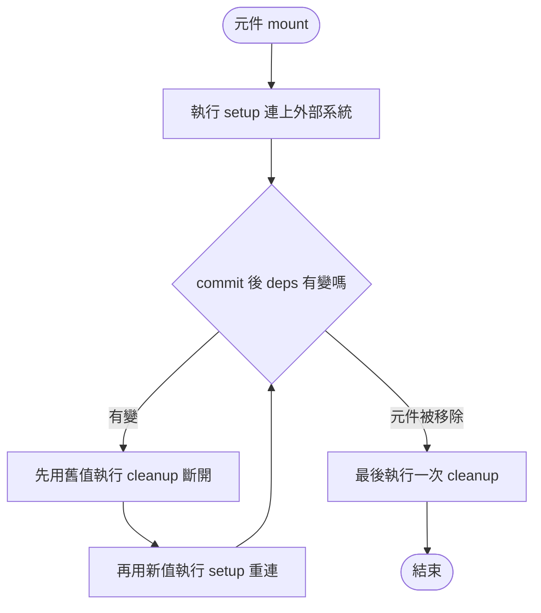

# useEffect：把元件同步到外部系統

> [!info] 本篇重點 a–g，共 7 個
> 主軸是 react.dev 官方 `useEffect` 頁面 Usage 第一節「Connecting to an external system」。
> Abby 在 Gemini 的追問只是支線，放在 f。
> 範例程式碼：`03-useEffect-外部系統-demo.jsx`（同資料夾，可直接貼進 CodeSandbox 跑）。流程圖在 c，自我測驗在 g，全部集中在這一個檔案。

---

## a. 一句話

`useEffect(setup, dependencies?)` 讓元件在畫面上存在的期間，持續和一個「React 管不到的東西」保持同步。

| 參數 | 白話 | 必填 |
|---|---|---|
| `setup` | 連上外部系統的函式，可以選擇性 `return` 一個 cleanup 函式負責斷開 | 是 |
| `dependencies` | setup 裡讀到的所有 reactive value（props、state、元件內宣告的變數與函式） | 否 |

**Effect（副作用）是概念，`useEffect` 是實作這個概念的 Hook。**
Effect 指的是「由渲染本身引起、需要和外部系統同步」的程式碼，跟「由某個使用者操作引起」的事件處理器是不同的東西。

| 程式碼放哪 | 誰觸發 | 能不能有副作用 | 例子 |
|---|---|---|---|
| 元件函式本體（render） | 每次 render | 不行，必須是純計算 | 用 props 算出要顯示的 JSX |
| 事件處理器 | 使用者的某個操作 | 可以 | 按下按鈕後送出表單 |
| Effect | 元件 commit 到畫面上這件事本身 | 可以，而且負責同步外部系統 | 元件出現時連上聊天室 |

**Effect 到底是什麼？同一個詞有三個層次，最常被搞混：**

| 層次 | 它是什麼 | 例子 |
|---|---|---|
| 概念 | 讓元件和外部系統保持同步的一段邏輯，由「元件出現在畫面上」這件事本身引起 | 元件出現時連上聊天室，消失時斷線 |
| 你寫的 API | `useEffect(setup, deps)` 這個 Hook，用來宣告一個 Effect | `useEffect(() => { ... }, [roomId])` |
| React 內部的資料 | Fiber 上的 Effect 物件 `{ create, deps, inst, next }` | `create` 存著 setup 函式，`inst.destroy` 存著 cleanup 函式 |

![[Effect的三個層次_概念API內部資料_2026-10-05.png]]

大寫的 Effect 是 React 的專有詞，指上面這個「同步」的概念。小寫的 side effect（副作用）是一般程式設計的詞，泛指「改動函式以外世界」的行為，例如改 DOM、發請求。Effect 是用來安放那些副作用的地方。

**Effect 跟 `useEffect` 是畫上等號嗎？官方措辭是「呼叫 `useEffect` 來宣告一個 Effect」。**
官方 Reference 的原句：*Call `useEffect` at the top level of your component to declare an Effect.* 句子裡 `useEffect` 是被呼叫的函式（API），Effect 是被宣告出來的東西，就像「呼叫 `useState` 來宣告一個 state 變數」。

| 面向 | 說明 |
|---|---|
| 日常用法 | 幾乎可以畫等號：一個 `useEffect(...)` 呼叫就宣告一個 Effect。官方說的「write every Effect as an independent process」是在說每個 `useEffect` 各寫成獨立的一組同步，「you probably don't need an Effect」就是在說「你大概不需要寫 `useEffect`」 |
| 嚴格來說 | 不完全相同。Effect 是概念與內部資料，`useEffect` 是宣告它的 API。另外宣告 Effect 的 Hook 不只 `useEffect`，還有 `useLayoutEffect` 與 `useInsertionEffect` |
| 原始碼證據 | 三個 Hook 共用同一種 Effect 物件，用 `tag`（`HookPassive`、`HookLayout`、`HookInsertion`）區分，所以 Effect 比 `useEffect` 範圍更大 |


Effect 的心智模型只有兩個動作：「開始同步」（setup）與「停止同步」（cleanup）。
它不等於元件的 mount、update、unmount 生命週期，所以 deps 變了會停止再開始，元件根本沒 unmount 也一樣。

![[Effect心智模型_兩個動作_2026-10-05.png]]

動作只有「開始同步」與「停止同步」兩個，另外有五件事需要一起記住：觸發的事件有五種、一個元件可以有很多個各自獨立的 Effect、每一輪同步用的是那一次 render 的值、沒寫 cleanup 時「停止」是空的、想讀最新值又不想重新同步要用 Effect Event（`useEffectEvent`）。詳見上圖下半部。

---

## b. 什麼是外部系統

判準只有一個：**不由 React 控制，需要你主動「連上」與「斷開」的東西。**
Web API 與 DOM 都算，因為 React 只管 render 出來的 JSX，不管瀏覽器另外提供的功能。

| 類別 | 例子 | setup 連上 | cleanup 斷開 |
|---|---|---|---|
| Web API（計時器） | `setInterval` | `setInterval(fn, 1000)` | `clearInterval(id)` |
| Web API（全域事件） | `window` 的 `pointermove` | `window.addEventListener(...)` | `window.removeEventListener(...)` |
| DOM（觀察者） | `IntersectionObserver` | `observer.observe(div)` | `observer.disconnect()` |
| DOM（元素方法） | `<dialog>` | `dialog.showModal()` | `dialog.close()` |
| 網路 | 聊天室連線 | `connection.connect()` | `connection.disconnect()` |
| 第三方函式庫 | 動畫庫、地圖 widget | `animation.start()` | `animation.stop()` |

---

## c. 什麼時候跑：三個時機



> [!important] cleanup 是 setup 函式的回傳值（`useEffect` 只收兩個參數）
> 通常是以 <mark style="background: #FFF3A3A6;">**setup 函式為主體**</mark>，由它 <mark style="background: #FF5582A6;">**`return` 出一個 cleanup 函式**</mark> 交給 React。
> `useEffect` 只收兩個參數：<mark style="background: #BBFABBA6;">setup 函式</mark> 與 <mark style="background: #ADCCFFA6;">依賴陣列</mark>。想「停止同步」時要做的事，是寫在 setup 函式裡面、被 `return` 出去的那個函式。
> 沒寫 `return`，就等於沒有 cleanup。

**官方原文的「包含」關係，以及誰先誰後：**
官方原文：*A setup function with setup code that connects to that system. It should return a cleanup function with cleanup code that disconnects from that system.*

| 名稱 | 是什麼 | 寫在哪 | 什麼時候執行 |
|---|---|---|---|
| setup 函式 | 傳給 `useEffect` 的第一個參數，整個箭頭函式 | `useEffect(` 的括號裡 | React 決定要「連上」時 |
| setup code | 函式裡負責 `connect()` 的那幾行 | setup 函式本體 | 跟著 setup 函式一起跑 |
| cleanup 函式 | setup 函式 `return` 出去的那個小函式 | 寫在 setup 函式裡面 | `return` 時只是被建立並交給 React 保管，之後才由 React 呼叫 |
| cleanup code | 小函式裡負責 `disconnect()` 的那幾行 | cleanup 函式本體 | 跟著 cleanup 函式一起跑 |

「包含」只在寫法上成立：cleanup 函式寫在 setup 函式裡面。
「cleanup 先於 setup」只對**下一次的** setup 成立，對它自己那一次不成立：cleanup 必須等 setup 跑過、把它 `return` 出來才存在，所以每個 cleanup 一定在它對應的 setup 之後。

| 步驟 | 事件 | 實際執行的順序 |
|---|---|---|
| 1 | mount | setup①（還沒有上一次的 cleanup，所以沒東西可先跑），產生 cleanup① |
| 2 | deps 變了 | cleanup①（用舊值）→ setup②，產生 cleanup② |
| 3 | unmount | cleanup② |

配對規則：setupN 先於 cleanupN，cleanupN 先於 setupN+1。

**官方三句話逐句對照：「cleanup 用舊值跑」是不是代表 cleanup 比 setup 先？**

| 官方原文 | 白話 | 誰先 |
|---|---|---|
| 1. Your setup code runs when your component is added to the page (mounts). | 掛載時只跑 setup，此時還沒有任何 cleanup 可跑 | setup 先 |
| 2. After every commit where the dependencies have changed: First, your cleanup code runs with the old props and state. Then, your setup code runs with the new props and state. | deps 變了的那次 commit，先用舊值跑上一輪的 cleanup，再用新值跑新的 setup | cleanup 先於「新的」setup |
| 3. Your cleanup code runs one final time after your component is removed from the page (unmounts). | 元件移除後最後再跑一次 cleanup | cleanup 最後 |

「with the old props and state」的意思是：這個 cleanup 是上一次 render 產生的，它抓住的是那一次 render 的 props 與 state（閉包），所以看到的是「舊值」。這不是在說 cleanup 優先，順序要看第 1、2、3 句合起來讀：setup① → cleanup①（舊值）→ setup②（新值）→ … → 最後一次 cleanup。

**「useEffect 裡面、cleanup 以外的都叫 setup code」嗎？大致是，要補三個精確的界線：**

```js
useEffect(() => {                                        // ← setup 函式（整個箭頭函式）
  const connection = createConnection(serverUrl, roomId); // ① setup code
  connection.connect();                                   // ① setup code
  return () => {                                          // ← 這一行在 setup 時執行，作用是建立 cleanup 函式
    connection.disconnect();                              // ② cleanup code
  };
}, [serverUrl, roomId]);                                  // ③ 依賴（第二個參數，不是會執行的 code）
```

| 名稱 | 範圍 | 什麼時候執行 |
|---|---|---|
| setup 函式 | 傳給 `useEffect` 的整個箭頭函式 | React 在 commit 之後呼叫 |
| setup code | setup 函式裡，扣掉 cleanup 函式本體，其餘會在 setup 時跑的敘述 | 跟著 setup 函式一起跑 |
| cleanup 函式 | `return` 出去的那個函式 | `return` 時只是建立，之後由 React 呼叫 |
| cleanup code | cleanup 函式的本體 | 跟著 cleanup 函式一起跑 |
| 依賴陣列 | `useEffect` 的第二個參數 | 不執行，React 拿來比較 |
| 元件本體（`useEffect` 外面） | `useState`、算變數等 | 每一次 render 都跑，不是 setup code |

官方範例標示的 setup code 只有 `createConnection` 與 `connect()` 兩行，也就是「負責連上外部系統」的那幾行。沒有 `return` 的 Effect 就沒有 cleanup code，整個函式本體都算 setup code。

**mount 跟「掛到瀏覽器上」是什麼關係？**
mount 指元件第一次被放進 React 的元件樹，React 實際做的事是在 commit 階段用 `createElement` 建出 DOM node，再用 `appendChild` 插進瀏覽器的 DOM 樹（最上層是 `createRoot(document.getElementById('root'))` 指定的容器）。
所以「掛到瀏覽器上」的精確說法是「插進 DOM 樹」，它跟「畫到螢幕上」是兩件事，中間隔著 browser paint。

| 順序 | 階段 | 發生什麼事 | 跟 Effect 的關係 |
|---|---|---|---|
| 1 | Render | 呼叫元件函式算出 JSX，純計算，還沒碰 DOM | Effect 完全不跑 |
| 2 | Commit：Mutation | 真正動 DOM，mount 就是此時 `appendChild` | DOM 已經存在，`ref.current` 此時才有值 |
| 3 | Commit：Layout | 同步執行 `useLayoutEffect` | 需要在畫面出現前量測或擺位置才用它 |
| 4 | Browser paint | 瀏覽器把 DOM 畫到螢幕 | 使用者此刻才看得到 |
| 5 | Passive | 執行 `useEffect` 的 setup | 一般情況在 paint 之後，所以可能看到閃爍 |

若這次 commit 是由點擊這類互動引起，React 可能在 paint 之前就先跑 Effect，所以不要假設 Effect 一定在 paint 之後。
React Native 沒有瀏覽器，mount 時 `appendChild` 的對象換成原生 UI，概念相同。
**那 mount 比較像 hydration 嗎？** hydration 是 mount 的一種做法，不是 mount 的同義詞。兩者都是「元件第一次在 client 掛載」，差別在 DOM 是新建還是認領：

| | 純 client 掛載（`createRoot().render`） | Hydration（`hydrateRoot`） |
|---|---|---|
| 起點 | 容器是空的 | 容器裡已經有 server 產生的 HTML |
| Render 階段 | 呼叫元件函式算出 JSX | 一樣呼叫元件函式算出 JSX |
| Commit 時對 DOM | 建立 DOM node 並 `appendChild` | 不建立，「認領」既有的 DOM node 並掛上事件監聽 |
| Effect 的 setup | commit 後執行 | hydration 完成後在 client 執行 |
| 一致性要求 | 無 | JSX 必須和 server 的 HTML 一致，否則出現 hydration mismatch |

兩種做法的 Effect 時機相同：setup 都在 client 上、掛載（含 hydration）完成之後才跑，server 上完全不跑。所以前面 e 段那個 `didMount` 技巧，就是利用「Effect 只在 client 掛載後才跑」，讓 server 與 hydration 時的輸出一致，掛載後才換成 client 專屬內容。
上面說 mount 時 `appendChild`，指的是純 client 掛載的情況，hydration 時 DOM 本來就存在。Hydration 的完整流程見 [[SSR-renderToString與Hydration-伺服器端渲染流程]]。

完整的階段圖見 [[React兩階段渲染-Render與Commit-Mount-Update-Unmount生命週期]]。

React 用 `Object.is` 逐項比較 deps 的新舊值，來決定要不要重跑。

| 依賴寫法 | 何時重跑 |
|---|---|
| `[a, b]` | 初次 commit 後，之後 `a` 或 `b` 變了才重跑 |
| `[]` | 只在初次 commit 後跑（開發模式多一輪，見 d） |
| 不寫 | 每次 commit 後都重跑 |

> [!warning] deps 不是你「選」的
> 程式碼裡讀了哪些 reactive value，就必須全部列進去，這由程式碼決定。
> 想拿掉某個依賴，要先「證明」它不是 reactive，例如把 `serverUrl` 搬到元件外面變成模組常數。
> 用 `eslint-ignore` 蓋掉警告，等於對 React 說謊。

---

## d. 鏡像原則與 StrictMode

cleanup 必須能把 setup 做的事完整復原，這叫「鏡像」。
官方原文逐句拆解：

| 官方原文 | 白話 |
|---|---|
| *To help you find bugs, in development React runs setup and cleanup one extra time before the setup.* | 為了幫你找 bug，開發模式下 React 在「真正的 setup」之前，先多跑一輪 setup 加 cleanup |
| *This is a stress-test that verifies your Effect's logic is implemented correctly.* | 這是壓力測試，用來驗證你的 Effect 邏輯有沒有寫對 |
| *If this causes visible issues, your cleanup function is missing some logic.* | 若這一輪造成使用者看得見的問題，代表 cleanup 漏寫了邏輯，見下方表格 |
| *The cleanup function should stop or undo whatever the setup function was doing.* | cleanup 的職責是停止或復原 setup 做的事 |

**stress test（壓力測試）是什麼：** 在比正常更嚴苛的條件下檢驗系統會不會壞。
軟體工程裡通常指「用極端的負載測穩定性」，這裡 React 施加的壓力不是流量，而是「重複」：模擬元件被卸載又重新掛載，看你的 Effect 能不能被反覆啟動、停止而結果不變。
正式環境只會 setup 一次，但真實世界裡元件本來就可能被卸載再掛載（切換路由、條件式渲染、Offscreen 保留狀態），開發模式提早幫你演練。
這句話裡的 development 指開發模式，也就是 `<StrictMode>` 包住元件時（Vite 與 CRA 的模板預設就包著）。正式上線（production）不會多跑。

**這個「多跑一次」發生在掛載（mount）那一刻，不是每次 re-render。**
React 在元件第一次掛載後，故意模擬一次「卸載再重新掛載」，所以順序是 **setup → cleanup → setup**，之後 deps 變動才照一般規則跑。

| StrictMode 的兩種「多跑一次」 | 跑的是什麼 | 什麼時候跑 | 目的 |
|---|---|---|---|
| 雙重 render | 元件函式本體被呼叫兩次 | 每一次 render，包含每次 `setState` 後的 re-render | 抓出不純的 render，見 [[01-React-純函數與嚴格模式-StrictMode]] |
| Effect 多一輪 | setup → cleanup → setup | 只在掛載那一次 | 抓出沒寫對的 cleanup |

**這個「多一輪」是第二次執行 `useEffect` 嗎？不是，是把同一個 Effect 的 setup 與 cleanup 再跑一輪：**

| 項目 | 為了這一輪有沒有再來一次 |
|---|---|
| `useEffect(...)` 這行 Hook 呼叫（登記 setup 與 deps） | 沒有，它是 render 時的事 |
| Effect 物件 | 沒有新建，還是同一個，`inst` 也是同一個 |
| setup 函式 | 多跑一次 |
| cleanup 函式 | 跑一次 |

實作上，commit 完成後 React 對「剛掛載、且位於 StrictMode 內」的 fiber 呼叫 `doubleInvokeEffectsOnFiber`，裡面是兩步：先 `disconnectPassiveEffect`（模擬卸載，會呼叫 cleanup），再 `reconnectPassiveEffects`（模擬重新掛載，會呼叫 setup）。
因為用的是同一個 Effect 物件，這一輪 setup 抓到的仍是同一次 render 的 props 與 state。
這跟 StrictMode 的雙重 render 是兩回事：雙重 render 會讓元件函式（含 `useEffect(...)` 那一行）被呼叫兩次，但那只是登記，不會執行 setup。

**React 怎麼做到 StrictMode 的「多一輪」：**
1. `<StrictMode>` 建立 fiber 時，React 把 `StrictLegacyMode`（Concurrent root 上再加 `StrictEffectsMode`）寫進該 fiber 的 `mode` 欄位，子孫 fiber 繼承。這些 mode 位元是用在「雙重 render」：`workInProgress.mode & StrictLegacyMode`。
2. 開發模式下，每次 commit 結束後（沒有被動 Effect 時）或 `flushPassiveEffects` 跑完後（有被動 Effect 時），React 都會呼叫 `commitDoubleInvokeEffectsInDEV`，跟有沒有用 StrictMode 無關。正式環境的建置會把 `__DEV__` 分支整段移除，所以不存在。
3. 它沿 fiber 樹往下走，遇到型別是 `<StrictMode>` 的 fiber，就記下「這底下在 StrictMode 內」。若某棵子樹沒有 `PlacementDEV`（剛被放進畫面）也沒有 `Visibility` 旗標，就提早 return，不再往下。只有「位於 StrictMode 內、且帶 `PlacementDEV` 旗標」的 fiber，才會被呼叫 `doubleInvokeEffectsOnFiber`。
4. `doubleInvokeEffectsOnFiber` 先 `disconnectPassiveEffect`（模擬卸載，呼叫 cleanup），再 `reconnectPassiveEffects`（模擬重新掛載，呼叫 setup）。

幾個名詞：

| 名詞 | 是什麼 |
|---|---|
| `fiber.mode` | 一個數字，當作位元旗標（每一個位元是一個開關）。`ConcurrentMode` 是 `0b1`、`ProfileMode` 是 `0b10`、`StrictLegacyMode` 是 `0b1000`、`StrictEffectsMode` 是 `0b10000`。用 `mode \|= StrictLegacyMode` 打開開關，用 `mode & StrictLegacyMode` 檢查（開發模式的 `HostRoot` 另外帶 `ProfileMode`）。子 fiber 建立時繼承父的 mode，所以 `<StrictMode>` 底下的整棵子樹都帶著 Strict 位元 |
| concurrent root | 用 `createRoot()` 或 `hydrateRoot()` 建立的 root，源碼裡 `root.tag` 是 `1`（`ConcurrentRoot`）。能做可中斷的 render、transition、自動批次更新。舊的 `ReactDOM.render` 建立的是 legacy root（`LegacyRoot`，`tag` 是 `0`） |
| fiber | 就是 FiberNode，Fiber 樹上的一個節點。它不是元件函式（函式存在 `fiber.type`），也不是 DOM 節點（DOM 存在 `fiber.stateNode`），而是 React 替「某個元件實例在樹上的那一格」記的帳卡：state、Effect、位置都記在它身上 |

**`mode |= StrictLegacyMode` 到底怎麼「打開開關」：**
mode 就是一個普通數字，寫成二進位，每一個位置（位元）是一個開關。用到的運算子：

| 寫法 | 名稱 | 做什麼 | 例子 |
|---|---|---|---|
| `0b1000` | 二進位字面量 | `0b` 開頭表示後面是二進位數字，`0b1000` 就是十進位 8 | `StrictLegacyMode` 就是 `0b0001000` |
| `a \| b` | 位元 OR | 兩數對齊，每一位只要有一個是 1，結果就是 1 | `3 \| 8` 得到 `11` |
| `a \|= b` | 複合賦值 | 算完 `a \| b` 再存回 `a`，等於 `a = a \| b` | `mode \|= StrictLegacyMode` 把第 3 位打開 |
| `a & b` | 位元 AND | 兩邊都是 1 才是 1，用來檢查開關 | `27 & 8` 是 `8`（開），`3 & 8` 是 `0`（關） |
| `~b` | 位元 NOT | 把每一位反過來，搭配 `&=` 關掉開關 | `mode &= ~StrictLegacyMode` |

實際數字（開發模式，已用 Node 執行驗證）：`HostRoot` 的 mode 是 `0000011`（3，ConcurrentMode 加 ProfileMode）。`<StrictMode>` 的 fiber 繼承 3，`|= StrictLegacyMode`（8）變 `0001011`（11），再 `|= StrictEffectsMode`（16）變 `0011011`（27）。它底下所有子 fiber 建立時，都把父的 mode 這個數字直接複製過來（`createFiberFromElement(element, returnFiber.mode, lanes)`），所以整棵子樹的 Strict 開關都是開的。「標註嚴格模式」就是這麼單純：只是在數字裡把某一位寫成 1，沒有任何特殊物件。

![[fiber_mode開關板_位元旗標_2026-10-05.png]]

**「`<StrictMode>` 通常在 root 底下」是什麼意思，為什麼：**
意思是 `<StrictMode>` 通常是 `HostRoot`（`root.current`，整棵 fiber 樹最上面那個節點）的第一個子節點，也就是 `render(<StrictMode><App /></StrictMode>)` 這種最外層包法。所以 `HostRoot` 自己的 mode 沒有 Strict 位元，Strict 位元是從 `<StrictMode>` 那個 fiber 開始才往下繼承。
通常這樣放的原因：
1. `<StrictMode>` 只檢查它底下的後代，要檢查整個應用就得包在最外層。
2. 它不產生任何 DOM，也只在開發模式有作用，包在最外層沒有成本。
3. 官方範本（例如 Vite 的 `main.tsx`）預設就這樣寫，⚠️ 這點依記憶，未核對。
也可以只包一部分，例如只包某個新功能，範圍外的元件不受影響。另外原始碼中 `createRoot(el, { unstable_strictMode: true })` 能讓 `HostRoot` 的 mode 一開始就帶 Strict 位元，但名稱有 `unstable_`，不是穩定的公開 API。

**三個短答：**

| 問題 | 短答 |
|---|---|
| 額外一輪的順序是 cleanup → setup 再來一次嗎 | 完整序列是 setup → cleanup → setup，只有這三步。第一個 setup 是掛載本來就要跑的，「額外一輪」只多了 cleanup 與第二個 setup，不是 cleanup → setup → cleanup → setup |
| `ReactFiberWorkLoop.js` 管什麼 | 管所有元件的 render 與 commit 流程，不只 useEffect。它是總指揮：`renderRootSync` 與 `renderRootConcurrent`（render 階段）、`commitRoot`、`flushPassiveEffectsImpl`、`commitDoubleInvokeEffectsInDEV`（commit 階段）都在裡面。各種 effect 的具體動作在 `ReactFiberCommitWork.js` 與 `ReactFiberCommitEffects.js`，Hook 的邏輯在 `ReactFiberHooks.js` |
| 模擬卸載算 commit 還是 render 階段 | commit 階段，屬於被動 Effect 那一段。render 階段不會呼叫任何 cleanup，真正要卸載時也只是在 render 階段標記 `ChildDeletion`，cleanup 要等到 commit 才跑 |

**「對 fiber 模擬卸載」是什麼意思：**
fiber 是元件實例的代理，所以「卸載這個元件」就是對它的 fiber 做一組動作。真正的卸載會做三件事：呼叫它所有 Effect 的 cleanup、把它的 DOM 從畫面移除、斷開 fiber 的指標交給 GC。
模擬卸載只做第一件：`disconnectPassiveEffect` 對函式元件呼叫 `commitHookPassiveUnmountEffects`，沿著 Effect 環呼叫每個 `inst.destroy`，而且順序刻意模仿真實刪除，先父後子。fiber 本身、state、DOM 都原封不動，接著 `reconnectPassiveEffects` 再把 `create` 呼叫一輪。
比喻：學生資料卡被標記「請假」，是對這個人的出席紀錄動手，資料卡本身還在櫃子裡。

**實測結果（React 19.3.0 開發版加 jsdom，腳本見 `03-useEffect-StrictMode實測.js`）：**

| 事件 | 正式環境 | 開發模式 StrictMode |
|---|---|---|
| 掛載 | setup | setup → cleanup → setup |
| deps 真的改變 | cleanup（舊）→ setup（新） | cleanup（舊）→ setup（新），沒有額外一輪 |
| re-render 但 deps 沒變 | 什麼都不跑 | 什麼都不跑 |
| 卸載 | cleanup | cleanup |

![[StrictMode實測_React19_真實執行順序_2026-10-05.png]]

對照你的兩個理解：

| 你的說法 | 判定 | 說明 |
|---|---|---|
| 開發模式也是掛載 setup，cleanup 等真的移除才用 | 只有正式環境是這樣 | StrictMode 的開發模式在掛載時，故意立刻呼叫一次 cleanup（模擬卸載），再 setup 一次（模擬重新掛載） |
| deps 真的改變時，會 setup → cleanup → setup → 又一次 cleanup | 不對 | 額外一輪只出現在「掛載」那一次。deps 改變只有 cleanup（舊）→ setup（新），沒有第二個自動的 cleanup |

**StrictMode 雙重 render 只登記不跑 setup，那怎麼知道 `useEffect` 沒寫好？**
React 沒有針對「漏寫 cleanup」的錯誤訊息，實測整個過程 `console.error` 與 `console.warn` 都是 0 則。要靠「多一輪」暴露出來的行為與 log 來判斷。雙重 render 檢查的是另一件事：元件函式本體純不純。

| 方法 | 做法 | 看到什麼，代表什麼 |
|---|---|---|
| 在 setup 與 cleanup 各放一行 `console.log` | 看 F12 Console | 掛載時應是 setup、cleanup、setup 交錯。若連續兩個 setup 中間沒有 cleanup，就是漏寫 cleanup |
| 看 F12 Network | 觀察同一個 API | 掛載時同一個請求送兩次，代表 fetch 沒用 `ignore` 旗標或 `AbortController` |
| 看行為 | 計時器、動畫、訊息 | 計數每秒加 2、動畫疊加、訊息重複，代表外部系統被啟動了兩次 |
| ESLint `react-hooks/exhaustive-deps` | 編輯器黃線 | 實測會警告 `missing dependency 'roomId'`，但對漏寫 cleanup 的 `setInterval` 完全沒警告 |

**官方說的 visible issues（使用者看得見的問題）就是：cleanup 沒把 setup 做的事復原，多出來的那一輪就留下殘骸。**
你的推論是對的：出現這種問題，就代表 cleanup 該去停止或取消 setup 剛剛建立的東西。順帶一提，這裡的 setup 是「連線的函式」，不是 class 的「建構函式」（constructor）。

| setup 做的事 | 沒寫 cleanup，StrictMode 下看到的 visible issue | cleanup 該做的事 |
|---|---|---|
| `setInterval(() => setCount(c => c + 1), 1000)` | 計數每秒加 2，因為同時有兩個計時器在跑 | `clearInterval(id)` |
| `window.addEventListener('pointermove', fn)` | 同一個事件處理了兩次 | `removeEventListener` |
| `connection.connect()` | 同一個房間連了兩條線，收到重複訊息 | `connection.disconnect()` |
| `animation.start()` | 動畫從頭疊了兩次 | `animation.stop()` |

**rule of thumb（經驗法則）的白話：**
官方原文：*the user shouldn't be able to distinguish between the setup being called once (as in production) and a setup → cleanup → setup sequence (as in development).*
意思是：使用者不該分辨得出「正式環境只 setup 一次」跟「開發環境 setup → cleanup → setup」是哪一個。
cleanup 把第一次 setup 完全抵銷掉，第二次 setup 之後的世界，就跟只 setup 一次的世界一模一樣，外部系統裡永遠只剩一份連線、一個計時器、一個監聽器。
連結的「See common solutions」就是教你怎麼補 cleanup，常見解法已經寫在本篇 b 段的表裡：每一種 setup 配一個反向的 cleanup。

可以直接跑 `03-useEffect-外部系統-demo.jsx` 裡的 `TimerNoCleanup`，在 StrictMode 下親眼看計數變兩倍快，再對照 `Timer` 修好的版本。

> [!tip] 什麼時候可以不寫 cleanup
> 官方的 `MapWidget` 範例沒寫 cleanup，因為那個 class 只管理傳進去的那個 DOM node，元件移除後 node 與 instance 都會被瀏覽器的 GC 回收。
> 細節見 [[02-useEffect的setup清理函式-return一個函式而不是執行它]]。

---

## e. 不是外部系統，就不要用 Effect

官方 Caveats 的原話是：不是在同步外部系統，你大概不需要 Effect。

| 情況 | 官方建議 |
|---|---|
| 用 state 算另一個 state | 直接在 render 中算，不要用 Effect |
| 在 Effect 裡 `fetch` 資料 | 可以做但要加 `ignore` 旗標避免 race condition，更建議用框架內建或 TanStack Query、SWR |
| 在 Effect 裡改 DOM 造成畫面閃爍 | 改用 `useLayoutEffect`，它會在瀏覽器 paint 之前跑 |
| 需要在伺服器端執行 | Effect 只在 client 跑，SSR 不執行，見 [[SSR-renderToString與Hydration-伺服器端渲染流程]] |

---

## f. 支線：Abby 追問 useRef 怎麼跟 Effect 搭配

官方範例（動畫、`<dialog>`、`IntersectionObserver`）都需要碰到真正的 DOM node，做法是三步：

1. `const ref = useRef(null)` 先準備一個空盒子。
2. JSX 寫 `<dialog ref={ref}>`，React 在 commit 階段把 DOM node 放進 `ref.current`。
3. Effect 在 commit 之後才執行，所以此時 `ref.current` 已經是真的 node，可以呼叫 `showModal()`。

兩個細節：

| 細節 | 原因 |
|---|---|
| 改 `ref.current` 不會觸發重新渲染 | ref 不是 reactive value，不用寫進 deps |
| 官方範例先寫 `const dialog = ref.current` 再給 cleanup 用 | 避免 cleanup 執行時 `ref.current` 已經指到別的東西 |

useRef 與 Vue `ref` 的差異見 [[useRef與Vue的ref-value-可變值不觸發渲染的兩種設計]]。
追問的原始對話連結在 frontmatter 的 `sources`，本次寫入時該網站無法重新讀取，內容以上述既有筆記為準。

---

## g. 自我測驗（點開標題看答案）

> [!question]- 填空：5 題
> 1. `useEffect` 的第一個參數叫 ＿＿＿ 函式，第二個叫 ＿＿＿。
> 2. React 比較依賴新舊值使用 ＿＿＿。
> 3. 不寫依賴陣列，每次 ＿＿＿ 之後都會重跑。
> 4. StrictMode 開發模式多跑的順序是 setup → ＿＿＿ → setup。
> 5. mount 在 commit 階段是呼叫 ＿＿＿ 把 DOM node 插進 DOM 樹。
>
> > [!success]- 答案
> > 1. setup、dependencies　2. `Object.is`　3. commit　4. cleanup　5. `appendChild`

> [!question]- 是非：依賴陣列可以自己挑要列哪些值。
> > [!success] 非
> > 程式碼裡讀到的 reactive value 就必須全列，由程式碼決定。

> [!question]- 是非：用 state 算出另一個 state，應該用 Effect。
> > [!success] 非
> > 這不是外部系統，直接在 render 中計算即可。

> [!question]- 是非：Effect 在伺服器端渲染時也會執行。
> > [!success] 非
> > Effect 只在 client 執行。

> [!question]- 是非：`window.addEventListener` 屬於外部系統。
> > [!success] 是
> > 它是瀏覽器提供的 Web API，不由 React 控制，需要 cleanup 移除。

> [!question]- 是非：mount 完成就代表使用者已經看到畫面。
> > [!success] 非
> > mount 是 DOM 插入完成，之後還要經過 browser paint 才會畫到螢幕。

> [!question]- 申論：用 5W1H 說明什麼是外部系統，並舉三個例子寫出各自的 cleanup。
> > [!success] 參考答案
> > What：不由 React 控制的東西。Why：React 只管 JSX，不會幫你斷開連線。When：mount 後連上，deps 變或 unmount 時斷開。How：setup 連上，cleanup 反向復原。
> > 例子：`setInterval` 配 `clearInterval`，`addEventListener` 配 `removeEventListener`，`observer.observe` 配 `observer.disconnect`。

> [!question]- 申論：Effect 與元件 mount／unmount 生命週期有什麼不同？為什麼 deps 變了 cleanup 也會跑？
> > [!success] 參考答案
> > Effect 只有「開始同步」與「停止同步」兩個動作，描述的是和外部系統的同步關係，不是元件存在與否。
> > deps 變了代表要同步的目標改變，必須先停止對舊目標的同步（cleanup 用舊值），再開始對新目標的同步（setup 用新值），元件不需要 unmount。

## 資料來源（含查證時間）

| 主題 | 連結 | 版本／時間 |
|---|---|---|
| React 官方文件：`useEffect`（Usage 的 Connecting to an external system、Caveats、deps 三種寫法） | https://react.dev/reference/react/useEffect | 依 Abby 於 2026-10-04 貼入的頁面全文整理 |
| React 官方文件：Synchronizing with Effects（Effect 與事件處理器的差別，依記憶與既有筆記整理） | https://react.dev/learn/synchronizing-with-effects | 2026-10-04 嘗試抓取被網路擋下，⚠️ 該段措辭未逐字核對 |
| React 官方文件：Render and Commit（mount 時 `appendChild`、paint 的說法，依既有筆記整理） | https://react.dev/learn/render-and-commit | 2026-10-04 嘗試抓取被網路擋下，⚠️ 未逐字核對 |
| React 官方文件：You Might Not Need an Effect | https://react.dev/learn/you-might-not-need-an-effect | 該頁面內連結，未重新抓取 |
| MDN：`IntersectionObserver` | https://developer.mozilla.org/en-US/docs/Web/API/Intersection_Observer_API | 該頁面內連結，未重新抓取 |
| MDN：`HTMLDialogElement.showModal()` | https://developer.mozilla.org/en-US/docs/Web/API/HTMLDialogElement/showModal | 該頁面內連結，未重新抓取 |
| React 官方文件：useEffect 的 Caveats 與 Troubleshooting（StrictMode 額外一輪 setup → cleanup、visible issues、rule of thumb 原文） | https://react.dev/reference/react/useEffect | 依 2026-10-04 貼入的全文，原文逐字引用 |
| React 官方文件：`hydrateRoot`（hydration 認領既有 DOM 的定義，依本 repo SSR 筆記整理） | https://react.dev/reference/react-dom/client/hydrateRoot | 該筆記 2026-09-15 查證，本次未重新抓取 |
| React 原始碼 `ReactFiberWorkLoop.js`（`doubleInvokeEffectsOnFiber`、`disconnectPassiveEffect`、`reconnectPassiveEffects`） | https://github.com/facebook/react/blob/main/packages/react-reconciler/src/ReactFiberWorkLoop.js | main 分支，2026-10-05 實際抓取核對 |
| React 原始碼 `ReactTypeOfMode.js` 與 `ReactFiber.js`（`StrictLegacyMode`、`StrictEffectsMode` 寫入 fiber 的 mode） | https://github.com/facebook/react/tree/main/packages/react-reconciler/src | main 分支，2026-10-05 實際抓取核對 |
| 自行實測：react 與 react-dom 19.3.0、jsdom、eslint 9、eslint-plugin-react-hooks 7.1.1 | 腳本 `03-useEffect-StrictMode實測.js` | 2026-10-05 實際執行 |
| React 原始碼 `ReactFiber.js`（`createHostRootFiber`、`<StrictMode>` 的 `mode \|= StrictLegacyMode`）、`ReactChildFiber.js`（子 fiber 繼承 `returnFiber.mode`、設 `PlacementDEV`）、`ReactDOMRoot.js`（`unstable_strictMode` 選項） | https://github.com/facebook/react/tree/main/packages | main 分支，2026-10-05 實際抓取核對 |
| Abby 的追問對話（Gemini） | https://gemini.google.com/app/5b6fc934e5d7f253 | 本次無法讀取，僅作索引 |
