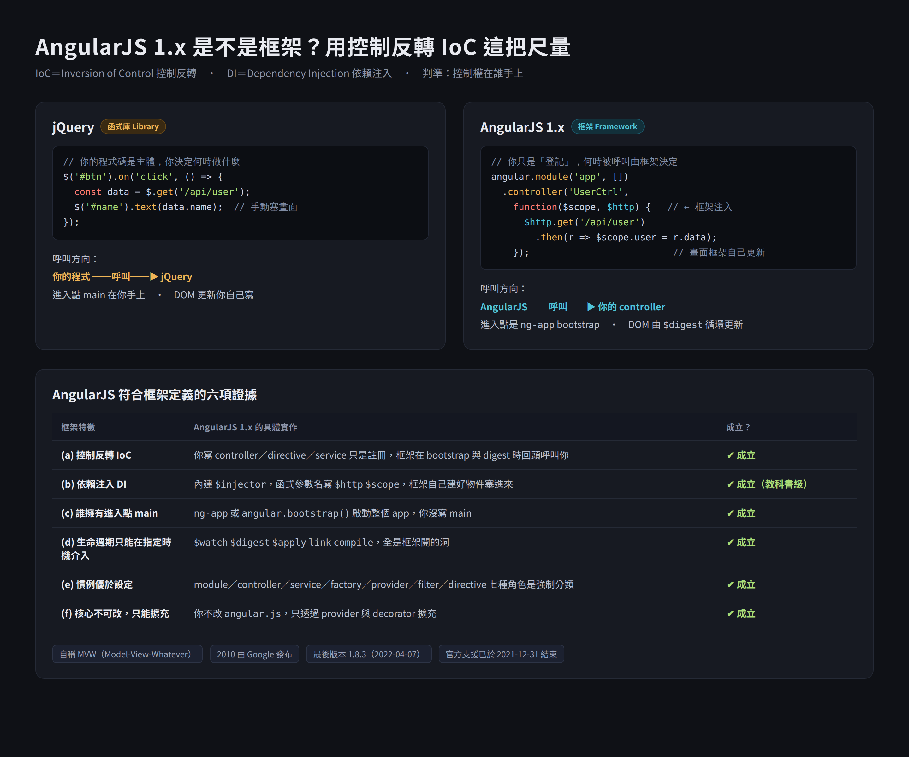

# 程序編程 Procedural Programming 與控制反轉 IoC 的呼叫方向對比

> 本篇重點 (a)–(g)，共 7 個。
> 名詞先攤開：**IoC（Inversion of Control，控制反轉）**、**API（Application Programming Interface，應用程式介面）**、**DI（Dependency Injection，依賴注入）**、**OOP（Object-Oriented Programming，物件導向程式設計）**。

> [!info] 這篇跟哪些筆記相關，以及為什麼
> - [[框架-vs-函式庫-控制反轉IoC]]：那篇從「框架 vs 函式庫」這個結論往回推判準，這篇則是把**被反轉的那一端**（也就是程序編程原本的樣子）講清楚。要理解「反轉」，得先知道**沒被反轉之前是什麼方向**，兩篇合起來才是完整的一組因果。
> - [[00-前端框架比較-Vue-React-Angular難易度與優缺點]]：Angular 之所以門檻高，正是因為它把 IoC 與 DI 做到最徹底，等於強迫你完全放棄程序式的主導權，本篇的 (e) 可以解釋那篇為什麼說 Angular 學習曲線最陡。
> - [[SERVICE_LAYER_AND_ARCHITECTURE_EXPLANATION]]：自家專案裡 FastAPI 決定何時呼叫 service 函式，就是 (d) 呼叫方向翻轉在 codebase 裡的實例。

## 重點整理

### (a) 定義：什麼是程序編程

<mark style="background: #ADCCFFA6;">程序編程（Procedural Programming，或譯程序式程式設計）</mark>是一種<mark style="background: #FFF3A3A6;">以「程序呼叫（Procedure Call）」為核心</mark>的程式設計範式（Paradigm）。程式的組成單位是一連串可被呼叫的程序、函數或子程序（Functions／Subroutines），而不是物件或宣告式的規則。

代表語言：C、Pascal、Fortran、早期的 BASIC；JavaScript 與 Python 也完全可以用程序式風格來寫。

### (b) 特徵一：命令式流程

程式碼由一系列**依序執行的指令**組成，明確地告訴電腦「步驟一做什麼、步驟二做什麼、步驟三做什麼」。這是 <mark style="background: #ADCCFFA6;">Imperative（命令式）</mark>的表現，跟 SQL、HTML 這類 <mark style="background: #ADCCFFA6;">Declarative（宣告式）</mark>只描述「我要什麼結果」形成對比。

### (c) 特徵二：主導控制權在你手上（Main Loop Control）

由開發者撰寫的主程式（例如 `main()` 函數）<mark style="background: #FFF3A3A6;">主導整個執行流程</mark>。當需要執行通用任務（格式化字串、計算數據、繪圖）時，主程式**主動呼叫**外部函式庫，函式庫處理完畢並傳回結果後，主程式再繼續下一步。

<mark style="background: #BBFABBA6;">這一點就是判斷「有沒有發生控制反轉」的支點。</mark>

### (d) 特徵三：資料與邏輯分離

程序編程通常把**資料結構（Data）**與**操作資料的函數（Functions）**分開處理，透過把資料當作參數傳入函數運算。這跟 OOP 把「資料 + 操作」封裝在同一個物件裡的作法正好相反，也是為什麼 OOP 常被視為程序編程之後的下一個階段。

### (e) 核心對比：呼叫方向翻轉

| 面向 | 程序編程 Procedural | 控制反轉 IoC |
|---|---|---|
| 呼叫方向 | <mark style="background: #FFF3A3A6;">你的程式 → 呼叫 → 函式庫</mark> | <mark style="background: #FFF3A3A6;">框架 → 呼叫 → 你的程式</mark> |
| 誰握有 `main` | 你 | 框架的 CLI／runtime |
| 你寫的東西是 | 主體 | 被插進去的零件 |
| 英文口訣 | Your code calls the library | Framework calls your code |
| 介入時機 | 你想呼叫就呼叫 | 只能在框架允許的擴充點 |

上圖左半就是 (c) 描述的程序式呼叫（jQuery：你的程式呼叫它、進入點 `main` 在你手上），右半則是控制反轉（AngularJS：你只是登記 controller，何時被呼叫由框架決定）。

### (f) 好萊塢原則 Hollywood Principle

<mark style="background: #BBFABBA6;">Don't call us, we'll call you（別打給我們，我們會打給你）。</mark>這是 IoC 的口語版本，也是最好背的一句面試答案：

- 程序編程／函式庫 ＝ 你打電話給它。
- 框架 ＝ 你留下電話（註冊 callback、實作介面、寫進指定檔名），它需要時打給你。

### (g) 「歷史性」這個詞的意思

Wikipedia 對 IoC 的敘述提到「inversion 是歷史性的用詞」——意思是這個「反轉」是<mark style="background: #D2B3FFA6;">相對於當年主流的程序式寫法而言</mark>的反轉，不是絕對意義上的顛倒。在 1980 年代之前，程式碼呼叫函式庫是預設樣貌，所以框架出現時才被形容成「控制流被反轉了」。今天如果你是從 React／Angular 開始學程式，你甚至會覺得框架呼叫你才是常態，這時候「反轉」反而不直覺——理解這個詞的歷史背景可以避免混淆。

---

## 自我測驗

> [!question] 是非題（點答案處可顯示／隱藏）
> 1. 程序編程中，`main()` 函數的控制權在框架手上。 → ||✘ 錯。程序編程的 `main` 在開發者手上，框架接手才叫控制反轉。||
> 2. 依賴注入 DI 就是控制反轉 IoC 的同義詞。 → ||✘ 錯。DI 只是實現 IoC 的其中一種手法，IoC 的範圍更大。||
> 3. 程序編程通常把資料與操作資料的函數分開處理。 → ||✔ 對。這正是它跟 OOP 封裝作風最大的差異。||
> 4. 「Don't call us, we'll call you」描述的是程序編程的呼叫方向。 → ||✘ 錯。那是好萊塢原則，描述的是框架（IoC）的方向。||

> [!question] 申論題
> 請用「呼叫方向」這一個判準，解釋為什麼 Express 通常被歸類為輕量框架而不是函式庫。
> → ||因為 `app.get('/path', handler)` 這個寫法，你並沒有主動呼叫 Express 去處理請求，而是把 handler 註冊進去，等 HTTP 請求進來時由 Express 回頭呼叫你的 handler。呼叫方向是「Express → 你的程式」，符合控制反轉，因此歸類為框架。反觀 Axios 這類函式庫，是你在需要時主動 `axios.get()`，方向是「你的程式 → 函式庫」。||

---

## 各對話來源

### 控制反轉與程序編程比較（2026-08-06）— https://gemini.google.com/app/810b5871d90afef6

使用者：在軟體設計中控制反轉是一個設計規則，也就是電腦程式客製化寫出來的部分接收控制流程從外部的來源，譬如一個框架。The term inversion is 歷史性的，一個有著反轉控制設計的軟體架構是被跟程序編程比較的。在程序編程，一個程式的客製程式碼會呼叫可重用的函式庫來照顧大部分的任務，但是控制反轉，它會是外部的程式碼或者架構在控制跟呼叫客製程式碼。what is procedural programming？

Gemini：程序編程（Procedural Programming）是一種以程序呼叫（Procedure Call）為核心的程式設計範式。核心概念有三：一是命令式流程，程式碼由一系列依序執行的指令、函數或子程序組成，明確告訴電腦步驟一做什麼、步驟二做什麼；二是主導控制權（Main Loop Control），由開發者撰寫的主程式（例如 `main()` 函數）主導整個執行流程，需要執行通用任務時主動呼叫外部函式庫，待函式庫回傳結果後再繼續下一步；三是資料與邏輯分離，通常把資料結構與操作資料的函數分開處理，透過把資料作為參數傳入函數運算。與控制反轉的對比：程序編程是「你的程式碼主動呼叫函式庫」（Your code calls the library），控制反轉則是由框架掌控全局，變成「框架主動呼叫你的程式碼」（Framework calls your code），也就是俗稱的「好萊塢原則」（Don't call us, we'll call you）。

---

## 資料來源（含查證時間）

| 主題 | 連結 | 版本／時間 |
|---|---|---|
| Gemini 對話原文 | https://gemini.google.com/app/810b5871d90afef6 | 對話日期 2026-08-06 |
| Procedural programming 定義（範式、程序呼叫、與 OOP 的關係） | https://en.wikipedia.org/wiki/Procedural_programming | 查證日 2026-08-06 |
| Inversion of Control 定義與「歷史性用詞」敘述 | https://en.wikipedia.org/wiki/Inversion_of_control | 查證日 2026-08-06 |
| Martin Fowler, InversionOfControl（經典出處，延伸閱讀） | https://martinfowler.com/bliki/InversionOfControl.html | 未抓取原文，僅供自行查閱 |

> [!check] 內容查核
> 本次 Gemini 的回答與 Wikipedia 的定義一致，未發現錯誤或杜撰。唯一要留意的是 Gemini 把「好萊塢原則」寫成「俗稱」，嚴格說它是 Richard Sweet 於 1983 年在 Mesa 專案文件中提出、後由 John Vlissides 推廣的設計原則，不只是俗稱。
