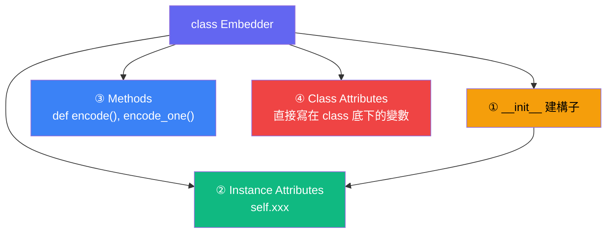

# Python Class 完整教學

> 用你自己的 `embedder.py` 當範例，從零搞懂 class。

---

## 1. Class 到底是什麼？

**一句話：Class 是「藍圖」，Object 是「蓋出來的房子」。**

```
Class（藍圖）          Object（實際的東西）
┌──────────────┐       ┌──────────────┐
│  Embedder    │──→    │  embedder_1  │  ← 一棟實際的房子
│  (設計圖)     │──→    │  embedder_2  │  ← 另一棟
│              │──→    │  embedder_3  │  ← 又一棟
└──────────────┘       └──────────────┘
```

- `class Embedder:` → 定義藍圖（這種東西要長什麼樣、能做什麼事）
- `embedder_1 = Embedder()` → 照藍圖蓋出一個**實體（instance / object）**

---

## 2. `self` 到底是什麼？

> [!IMPORTANT]
> **`self` 不是 class 的「基礎元素」，而是 instance（物件）的代稱。**
> 它代表的是「**正在操作的那一個物件自己**」。

### 最簡單的比喻

想像你在表格上填資料：

| 欄位 | embedder_1 的值 | embedder_2 的值 |
|------|-----------------|-----------------|
| `self.model_name` | `"BAAI/bge-m3"` | `"all-MiniLM-L6-v2"` |
| `self.dim` | `1024` | `384` |
| `self.model` | （bge-m3 模型物件） | （MiniLM 模型物件） |

每一列的 `self` 代表的是「**這張表的主人**」。

- 當 `embedder_1` 在跑 → `self` = `embedder_1`
- 當 `embedder_2` 在跑 → `self` = `embedder_2`

### 用生活化的方式理解

```python
class 人:
    def 自我介紹(self):
        print(f"我叫 {self.名字}")

小明 = 人()
小明.名字 = "小明"

小華 = 人()
小華.名字 = "小華"

小明.自我介紹()  # → 我叫 小明   (self = 小明)
小華.自我介紹()  # → 我叫 小華   (self = 小華)
```

**`self` 的意思就是「我自己」—— 誰呼叫這個 method，self 就是誰。**

---

## 3. Class 的四大組成元素

用你的 [embedder.py](file:///c:/coding/futuresign/abby-notes-rag/src/embedder.py) 來對照：



### ① `__init__`：建構子（Constructor）

```python
def __init__(self, model_name: str | None = None):
    self.model_name = model_name or Config.EMBEDDING_MODEL
    self.model = SentenceTransformer(self.model_name)
    self.dim = Config.EMBEDDING_DIM
```

- **什麼時候跑？** 當你寫 `Embedder()` 的瞬間自動執行
- **做什麼？** 幫新生的物件「裝備初始狀態」
- **為什麼需要？** 每個物件可能需要不同的初始值

> [!NOTE]
> `__init__` 的雙底線叫 **dunder（double underscore）**。
> Python 用 dunder methods 來定義物件的「特殊行為」，
> 例如 `__init__`（建立時）、`__str__`（被 print 時）、`__len__`（被 len() 時）。

### ② Instance Attributes（實例屬性）：`self.xxx`

```python
self.model_name = ...   # 每個 instance 可以有不同的 model name
self.model = ...        # 每個 instance 載入不同的 model
self.dim = ...          # 每個 instance 記錄自己的維度
```

- **用 `self.` 開頭** → 這個資料「屬於這個物件」
- **每個 instance 各自獨立**，互不干擾

### ③ Methods（方法）：可以對物件做的事

```python
def encode(self, texts, batch_size=32):      # 把文字批次轉向量
def encode_one(self, text):                   # 把單一文字轉向量
```

- 第一個參數永遠是 `self`（Python 的規定）
- 透過 `self` 可以存取該物件的所有資料

### ④ Class Attributes（類別屬性）—— 你的檔案沒用到，但要知道

```python
class Dog:
    species = "Canis familiaris"   # ← Class attribute：所有狗共用
    
    def __init__(self, name):
        self.name = name           # ← Instance attribute：每隻狗不同
```

| 類型 | 位置 | 共享？ | 例子 |
|------|------|--------|------|
| Class Attribute | `class` 底下直接寫 | ✅ 所有 instance 共用 | `Dog.species` |
| Instance Attribute | `self.xxx` | ❌ 每個 instance 獨立 | `self.name` |

---

## 4. 完整生命週期：你的 Embedder 到底怎麼運作？

```python
# STEP 1：Python 看到 class Embedder，只是「記住藍圖」，什麼都還沒建
class Embedder:
    def __init__(self, model_name=None):
        self.model_name = model_name or "BAAI/bge-m3"
        self.model = SentenceTransformer(self.model_name)
        self.dim = 1024

    def encode(self, texts, batch_size=32):
        return self.model.encode(texts, batch_size=batch_size, normalize_embeddings=True)

    def encode_one(self, text):
        return self.encode([text])[0]
```

```python
# STEP 2：建立物件 → 自動跑 __init__
emb = Embedder()
# 這一步 Python 在背後做了：
# 1. 在記憶體分配一塊空間給新物件
# 2. 把新物件傳給 __init__ 的 self 參數
# 3. 跑 __init__ 裡的所有 self.xxx = ... 設定
# 4. 把設定好的物件交給 emb 這個變數
```

```python
# STEP 3：使用物件
vector = emb.encode_one("你好世界")
# 這一步 Python 在背後做了：
# 1. emb.encode_one("你好世界")
#    → 等同於 Embedder.encode_one(emb, "你好世界")
#    → self = emb
# 2. 進入 encode_one，self.encode([text]) 
#    → emb.encode(["你好世界"])
#    → self.model.encode(...)
#    → emb.model.encode(...)  ← 用的是「這個物件」載入的 model
```

> [!TIP]
> `emb.encode_one("你好世界")` 其實就是 `Embedder.encode_one(emb, "你好世界")` 的語法糖。
> Python 自動把 `.` 前面的物件塞進第一個參數（`self`）。

---

## 5. 沒有 Class 會怎樣？

如果不用 class，你的 `embedder.py` 會變成這樣：

```python
# 😵 沒有 class 的寫法 — 全域變數散落各處
model_name_1 = "BAAI/bge-m3"
model_1 = SentenceTransformer(model_name_1)
dim_1 = 1024

model_name_2 = "all-MiniLM-L6-v2"
model_2 = SentenceTransformer(model_name_2)
dim_2 = 384

# 要自己記哪個 model 配哪個 dim，容易搞混
def encode_with_model_1(texts):
    return model_1.encode(texts, normalize_embeddings=True)

def encode_with_model_2(texts):
    return model_2.encode(texts, normalize_embeddings=True)
```

```python
# 😎 有 class 的寫法 — 乾淨整齊
emb1 = Embedder("BAAI/bge-m3")
emb2 = Embedder("all-MiniLM-L6-v2")

emb1.encode(texts)   # 用 bge-m3
emb2.encode(texts)   # 用 MiniLM
# 每個物件自己管好自己的資料，不會搞混
```

---

## 6. 總結：一張圖看完

```
┌─────────────────────────────────────────────────────┐
│                    class Embedder                    │
│                     （藍圖）                          │
│                                                     │
│  __init__(self, model_name)     ← 建構子：初始化     │
│      self.model_name = ...      ← 實例屬性          │
│      self.model = ...           ← 實例屬性          │
│      self.dim = ...             ← 實例屬性          │
│                                                     │
│  encode(self, texts)            ← 方法              │
│  encode_one(self, text)         ← 方法              │
└──────────────────┬──────────────────────────────────┘
                   │
         Embedder() 建立 instance
                   │
          ┌────────▼────────┐
          │   emb (物件)     │
          │                 │
          │ .model_name     │ ← 這個物件自己的資料
          │ .model          │
          │ .dim            │
          │ .encode()       │ ← 這個物件能做的事
          │ .encode_one()   │
          └─────────────────┘
```

> [!IMPORTANT]
> ### 你問的核心問題：`self` 算是 class 的基礎元素嗎？
> 
> **更精確的說法是：**
> - `self` 是 **method 的第一個參數**，代表「呼叫這個 method 的那個 instance」
> - 它不是 class 的「元素」，而是 **class 與 instance 之間的橋樑**
> - 透過 `self`，method 才能存取和修改「這個物件」的資料
> 
> **你可以這樣講：**
> 「`self` 是 Python class 中 method 引用當前 instance 的機制。」
