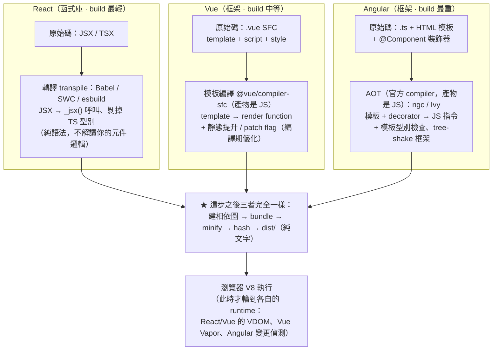
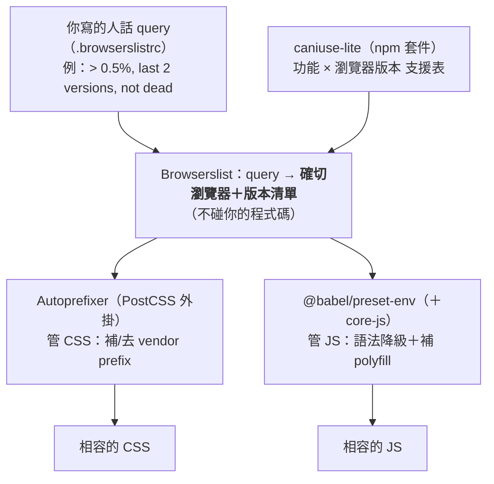

# 【打包 buildtime】前端建置流水線：從原始碼到瀏覽器（每一步 × 時間點）

##### 用詞約定：buildtime 說「轉譯」，runtime 才說「編譯」

> **Lint 與 Parser 到底落在哪一步、哪個時間點？**（互動 node graph 見同資料夾 `…-互動版.html`，點方塊看時間點）
> - **Lint（ESLint／Prettier）＝旁支的「品質閘門」，不是打包步驟、更不在瀏覽器**。它被觸發的時機都在**開發～build 之前**：存檔時（編輯器）、commit 前（git pre-commit hook，<mark style="background: #FFF3A3A6;">選用</mark>）、build 前（prebuild／CI）——這些只是 Lint 的**觸發時機**，不是主流程的階段。<mark style="background: #FF5582A6;">git commit 跟建置／執行 pipeline 無關</mark>，只是有人順手把 hook 掛在那；它只讀原始碼、回報或自動修，**不改最終 bundle**，失敗就中止 build。
> - **Parser 出現在兩個不同時間點、是兩個不同工具**：**build 時** bundler 用 **acorn**（在「建相依圖」那步 parse→AST→讀 import）；**run-time** 時瀏覽器用 **V8 自己的 parser**（parse→AST→bytecode→機器碼）。同樣叫 Parser，但工具不同、時間不同。（acorn 家族的 espree 也被 ESLint 拿去 parse，所以 Parser 是 bundler 與 ESLint 共用的底層零件。）

## buildtime 全流程地圖：每一步做了什麼、主場在哪一篇

> [!info]+ 為什麼同一件事會散在三篇？（關聯理由）
> a. <mark style="background: #BBFABBA6;">本篇（03）回答的是「buildtime 有哪些工具、各自做什麼」</mark>——是**靜態的角色分工**（誰是轉譯器、誰是打包器、誰是 Linter）。
> b. <mark style="background: #ADCCFFA6;">[[08-npm-run-script-mechanism]] 與 [[09-npm-scripts-pre-post-生命週期鉤子]] 回答的是「這些工具是誰觸發、依什麼順序被叫起來」</mark>——是**動態的執行序**。你之所以覺得「buildtime 的步驟到底做了哪些事都在 script 那篇」，正是因為 `npm run build` 這條命令才是把上面所有工具串起來跑的那根線。
> c. 兩者的接縫在一句話：<mark style="background: #FFF3A3A6;">`package.json` 的 `scripts` 是「劇本」，本篇介紹的工具是「演員」</mark>。只看演員名單不知道演出順序，只看劇本不知道每個演員會做什麼，所以要對照著讀。

| #   | buildtime 的一步           | 實際做了什麼                                                                                                                                                                                                                                                                                          | 主場筆記                                                                      |
| --- | ----------------------- | ----------------------------------------------------------------------------------------------------------------------------------------------------------------------------------------------------------------------------------------------------------------------------------------------- | ------------------------------------------------------------------------- |
| 1   | 觸發                      | 你打 `npm run build`。`run` 是 npm 的子指令，意思是「去 `scripts` 物件找這個 key，把對應字串丟給系統 shell 執行」，不是 npm 自動幫你加的                                                                                                                                                                                                 | [[08-npm-run-script-mechanism]]                                           |
| 2   | 找得到工具                   | npm 執行 script 前會把  `node_modules/.bin` 塞進 `PATH` 所以 `"build": "vite build"`  可以直接寫套件名、不用寫完整路徑 ->意思是說vite在node_modules裡面。                                                                                                                                                            | [[09-npm-scripts-pre-post-生命週期鉤子]] 第 l 點                                  |
| 3   | 前置鉤子 `prebuild`         | npm 自動先跑同名 `pre` 腳本（常見用途：`rimraf dist` 清掉上次產物、先跑一次 lint 或 type check）                                                                                                                                                                                                                           | [[09-npm-scripts-pre-post-生命週期鉤子]] 第 e、f 點                                |
| 4   | 建立依賴圖 （其實跟轉譯是交織在一起的） | bundler 從入口檔（`main.tsx`／`index.js`）開始：**先用 parser（如 acorn）parse 每個檔、讀出它有哪些 `import`**，再**用 resolver（如 webpack 的 `enhanced-resolve`、Rollup 的 `@rollup/plugin-node-resolve`）resolve 那些 import 指到的實際檔案（含去 `node_modules` 找第三方）**，一路遞迴掃出整張 module graph。**parse 與 resolve 一樣重要：一個讀出「要什麼」、一個找出「在哪」** | 本篇第 1、6 節                                                                 |
| 5   | **轉譯 transpile**        | Babel／`tsc`／SWC 把 TSX、JSX、新語法轉成標準 JS。**方向是高階→高階，所以叫轉譯不叫編譯**                                                                                                                                                                                                                                     | 本篇第 1 節（5 步表）、6 節                                                         |
| 6   | 品質把關                    | ESLint 抓邏輯問題與潛在 bug，Prettier 統一格式。實務上常掛在 `prebuild` 或 CI，不是打包器本身的職責                                                                                                                                                                                                                             | 本篇第 3 節 ＋ 上面第 3 步                                                         |
| 7   | **壓縮 minify**           | 移除註解、空白、換行，縮短變數名                                                                                                                                                                                                                                                                                | 本篇第 1 節（5 步表）                                                             |
| 8   | **打包 bundle**           | 把多個模組合併成少數幾支檔案，做 code splitting 與帶 hash 的檔名                                                                                                                                                                                                                                                     | 本篇第 1 節（5 步表） ＋ [[10-next-turbopack-server-chunks-hash-comparison]]       |
| 9   | 後置鉤子 `postbuild`        | `build` 成功結束才跑；<mark style="background: #FF5582A6;">build 失敗（非 0 退出碼）時不會執行</mark>                                                                                                                                                                                                               | [[09-npm-scripts-pre-post-生命週期鉤子]] 第 f 點                                  |
| 10  | 交棒                      | 產物丟上伺服器。<mark style="background: #ADCCFFA6;">buildtime 到這裡就結束了</mark>，瀏覽器下載到的是第 8 步的產物，之後才輪到 V8 的 runtime 編譯                                                                                                                                                                                    | [[04-V8引擎完整管線-Parse到Deoptimization-【編譯runtime】\|04-V8引擎完整管線（編譯 runtime）]] |

> [!tip]- 一句話記法
> **08 教你 `run` 怎麼找到指令 → 09 教你指令前後還會偷跑什麼 → 03（本篇）教你被跑起來的那些工具各自在做什麼 → 04 才是瀏覽器拿到產物之後的事。**

## 各工具在流水線的哪一階（對照最上面的全流程地圖）

### 1. 打包（build）到底做了什麼——詳細 5 步（含 content hash）

為什麼要打包：開發碼含偵錯工具、未壓縮、好讀註解，且瀏覽器不認得 JSX/TS；build 時要處理成瀏覽器能吃的靜態檔。這 5 步就是最上面地圖第 4–8、10 步的細節（跟 [[script載入方式+前因後果]] 的打包 5 步一致）：

分兩階段：**A 內部交織、不分先後；B 才有順序**（所以不硬編 1→2→3→4→5）。

| 階段 | 動作 | 誰做 | 做什麼 → 產物 |
|---|---|---|---|
| **A. 分析＋轉譯** （同一趟、交織；先把碼讀懂＋統一成標準 JS，不是先做完①才做②） | 建相依圖 | bundler core | **bundler** 讀入一支檔的原始碼 → **acorn**（輕量 parser）**把原始碼 parse 成 AST**，bundler 從 AST **讀出每個 `import` 的受詞＝路徑字串 specifier**（如 `'./Button'`、`'react'`）→ 把 specifier **交給 enhanced-resolve、由它 resolve 成磁碟上的實際檔路徑**（**不只 `node_modules`**：相對路徑、alias 也都它 resolve）→ bundler 開那支檔、遞迴 → module graph |
| **A**（同一趟） | 逐檔 transpile | Babel／SWC／esbuild | 每讀到一個 `.tsx`/`.jsx` 就轉成標準 JS（否則 parse 不出它的 import）→ 純文字 JS |
| **B. 合成＋輸出** （有先後） | bundle | bundler core | 合併成 chunk ＋ tree-shaking（砍死碼）＋ code-splitting（切 vendor/lazy）＋ scope-hoisting → 少數幾支 JS |
| **B** | minify | Terser／esbuild／SWC | 去空白/註解、縮短變數名 → 更小的 JS |
| **B** | hash ＋ 產出 | bundler core | 檔名帶 **content hash**（`main-a1b2c3.js`）＋把 `<script>`/`<link>` 注入 `index.html` → `dist/` 靜態檔 |

> **記法**：與其背 ①→②→③→④→⑤，不如記兩個階段——**A「先一趟把碼讀懂＋統一成標準 JS」**（建圖與轉譯**交織、同一趟**，不是先做完①才做②）→ **B「再合成輸出」**（bundle→minify→hash，這三個才真的有先後）。

> **content hash 為什麼是必要的第 5 步（你上次問的）**：內容沒變→檔名不變→瀏覽器直接用**快取**；內容一變→檔名就變→強制重抓（cache busting）。這不是「打包三大任務」漏寫，而是本來就有的第 5 步。

> **為什麼「建圖①」後馬上「轉譯②」、又擺在 bundle/minify 前面？**
> - 轉譯**不是「去掉東西」**——去死碼是③ tree-shaking、去空白是④ minify。轉譯是**把語法翻成標準 JS**（`JSX→createElement`、`TS→JS`；唯一算「去掉」的是 TS 型別註記）。
> - 建圖①與轉譯②其實**交織、同一趟走訪**：bundler 要建圖得讀每個檔的 `import`，但 `.tsx`/`.jsx` 不是合法標準 JS，**每讀到一個檔就先轉譯成標準 JS，才 parse 得出它的 import**、把圖往下接。所以是「邊建圖邊逐檔轉譯」，不是整張圖建完才轉。
> - 轉譯要**早**（在③④前）：因為 tree-shaking 要分析 ES `import/export`、minify 要處理 JS——**都得先把大家統一成標準 JS** 才做得了。

> **acorn 與 enhanced-resolve 怎麼拋接球（動詞、受詞都寫清楚）**
> 1. **bundler** 讀入一支檔的**原始碼**（受詞）。
> 2. **acorn（輕量 parser）把原始碼 parse 成 AST**；**acorn 不寫 manifest、也不去找檔案**，它只負責「文字 → AST」。
> 3. **bundler 從 AST 讀出每個 `import` 的路徑字串（specifier）**——就是 `import X from './Button'` 裡的 `'./Button'`、`import 'react'` 裡的 `'react'`。
> 4. **bundler 把 specifier 拋給 enhanced-resolve**；**enhanced-resolve 把 specifier resolve 成磁碟上的實際檔路徑**。**它不只找 `node_modules`**：相對路徑（`./Button` → 補副檔名、找 index）、alias、裸套件（`react` → `node_modules/…`）**全都由它 resolve**。
> 5. **bundler 開那支被 resolve 出來的檔**，回到第 1 步（遞迴），掃出整張 module graph。
>
> ⚠️ 修正兩個常見誤會：**acorn 不是「去找自己的檔案」**（它只把文字 parse 成 AST，不找檔）；**enhanced-resolve 不是「只找 node_modules」**（相對路徑/alias 也是它 resolve）。**manifest 不在這一步**——manifest 是**輸出/bundle 階段**產生、給 runtime 載 chunk 用的對照表，跟 acorn 無關。

### 2. 誰來做這 5 步（工具比較）

開發碼未壓縮、好讀；為上線快又穩，用打包工具做<mark style="background: #FFF3A3A6;">「生產（production）打包」</mark>——也就是上面那 5 步。下表比較各工具。

> [!note] 看到「This page is using the production build of React」就代表：這網頁用的是經打包工具優化後的 React，已準備好上線，而非開發模式。

| 工具（問世）                              | 語言              | 類型                               | 特點 / 2026 現況                                                                                                                                                 |
| ----------------------------------- | --------------- | -------------------------------- | ------------------------------------------------------------------------------------------------------------------------------------------------------------ |
| **Webpack**（2012）                   | JS              | bundler                          | 歷史悠久、生態成熟、所有框架通用；但 dev 是 **bundle-based**（啟動時先把整個 app 打進記憶體）＋核心用 JS 單執行緒，<mark style="background: #FF5582A6;">HMR 最慢</mark>；需大量 Loaders／Plugins；下載量仍最多但新專案少選 |
| **Rollup**（2015）                    | JS              | bundler                          | 推廣 tree-shaking、ESM-first；早期偏函式庫打包；曾是 Vite 生產打包的底層                                                                                                           |
| **esbuild**（2020）                   | Go              | transpiler／bundler               | 極快，多被當「其他工具內部的轉譯器」；Vite 開發期用它做預轉譯                                                                                                                            |
| **Vite**（2020） ESM-based modules | JS（底層借 Go/Rust） | build tool（含 dev server＋bundler） | 開發用原生 ESM＋esbuild 不 bundle、生產用 Rollup（Vite v8 起改 Rolldown）；<mark style="background: #BBFABBA6;">2026 新專案預設</mark>                                            |
| **Turbopack**（2022）                 | Rust            | bundler                          | Vercel 做、<mark style="background: #BBFABBA6;">增量只重跑變動部分</mark>；Next.js 專用，`next dev --turbo`                                                                 |
| **Rolldown**（2024→Vite v8, 2026）    | Rust            | bundler                          | Rollup 的 Rust 重寫；Vite v8 起取代 esbuild＋Rollup                                                                                                                  |
| **Next.js**（2016）                   | —（JS 框架）        | **框架，不是 bundler**                | 底層用 Turbopack／Webpack 這些 bundler，另外加路由／SSR／資料抓取                                                                                                              |

> ⚠️ 主詞分清：**Webpack／Rollup／esbuild／Turbopack／Rolldown 是 bundler（打包器）**；**Vite 是 build tool**（把 bundler ＋ dev server 包成一套）；**Next.js 是框架**（把某個 bundler 再包一層、加路由/SSR）。所以「為何不比較 Next.js」——它跟前面那些不是同一層，它是**用**它們的人。

> [!warning] 你最大的卡點：那句「bundle the entire application **on startup**」講的是 **dev server 啟動**，不是這篇的「生產 build（階段 A/B）」——兩條不同的線
> 同一個工具其實**跑兩種不同的時機**，別混在一起：
>
> | | ① dev（`npm run dev`，你邊寫邊看的那台 server） | ② 生產 build（`npm run build`，上線前產出 `dist/` 那一次） |
> |---|---|---|
> | **Webpack** | 啟動時**先把整個 app 建相依圖＋transpile＋bundle 進記憶體**才給你看畫面 → 專案越大越慢（原文的 **30 秒**） | 完整跑本篇 5 步，產出 `dist/` |
> | **Vite** | **不預先 bundle 你的原始碼**：瀏覽器用 native ESM 一個個 `import`，Vite 才**即時、逐檔**用 esbuild transpile 瀏覽器當下要的那支檔（原文的 **300 毫秒**）；只對 `node_modules` 先做一次預打包 | **一樣**完整跑 5 步（≤v7 用 Rollup、v8 用 Rolldown），產出 `dist/` |
>
> 所以回答你的三個疑問：
> a. **「它一開始就把整個 app 打包」＝ Webpack 的 dev server 啟動行為**，不是生產 build。它**沒有跳過**建相依圖與 transpile——反而是**每次啟動都把整包做一遍**（做進記憶體），這正是它慢的原因。
> b. **Vite 有沒有省略階段 A？** 在 **dev**：它不對你的原始碼做「整包一次做完」的階段 A，而是**改成 lazy、逐檔、瀏覽器要哪支才做哪支**（transpile 沒省，只是延後＋分散）。在**生產 build**：它**一步都沒省**，跟 Webpack 一樣完整跑 5 步。你 03 這篇的階段 A/B 講的就是 ②生產 build，**別拿它去套 ①dev 的敘述**。
> c. **「為什麼原文講的是『載入』不是『編譯』」**：因為 dev server 的工作就是**在你開發時把模組一支支送進瀏覽器**——這是**開發期的模組載入**，跟 `npm run build` 的生產編譯是**不同的一次執行**。原文整段（startup／30s／HMR）都在講 **dev 這條線**，你會覺得對不上，是因為你腦中裝的是 build 那條線。**地圖比喻**：Webpack＝出門前把整張地圖畫完才讓你出發；Vite dev＝給你 GPS，走到哪個路口、瀏覽器要哪塊，才即時畫那一塊。

### 2b. 普及率／滿意度／下載量（面試講哪個用得上）

> 面試想「講哪個比較有料」就看這張。**普及率／滿意度**＝[State of JS 2025](https://2025.stateofjs.com/en-US/libraries/build-tools/)（用過的人比例／滿意的人比例）；**下載量**＝[npm trends](https://npmtrends.com/esbuild-vs-rollup-vs-vite-vs-webpack)每週下載（數字很吵、會含被當相依與 CI 快取，點進去看即時值）。只有 webpack·vite·esbuild 有官方明確數字，其餘官方只給趨勢，故標「—」。

| 工具 | 問世年 | 語言 | 普及率² | 滿意度² | 下載量³ |
| --- | --- | --- | --- | --- | --- |
| Vite | 2020 | JS→Rust | 84% | **98%**（最高） | ~25M |
| Webpack | 2012 | JS | **86%**（最高） | 55%（偏低） | ~30–55M |
| esbuild | 2020 | Go | 54% | — | ~200M＋（被當相依） |
| Rollup | 2015 | JS | — | — | ~20M |
| Turbopack | 2022 | Rust | —（隨 Next 上升） | —（偏低） | 隨 next 裝 |
| Rolldown | 2024 | Rust | —（興趣度第一） | — | 新 |

面試一句話：**「新專案我會選 Vite——普及率已逼近 Webpack、滿意度卻是全場最高（98% vs 55%），因為 dev 用 native ESM 讓 HMR 維持毫秒級；Webpack 生態最成熟、舊專案多，但 dev 是 bundle-based 又 JS 單執行緒所以慢；底層趨勢是 Rust（Rolldown／Turbopack）在吃掉打包這層。」**

> 🎯 Vite 的五大機制（隨選載入／HMR／依賴預構建／生產 Rollup／冷啟動）面試複習專篇：[[11-Vite核心機制-隨選載入-HMR-依賴預構建-生產Rollup-冷啟動]]。

表格裡你看不懂的三點，講清楚：

- **esbuild 為什麼身兼 transpiler／bundler 二職**：esbuild 內部**同時**實作了 parser ＋ transpiler ＋ bundler ＋ minifier（Go 寫、極快），所以它**單獨就能 transpile、也能 bundle**。只是很多工具只借它的一部分——例如 Vite 開發期只用它「預轉譯依賴」那塊、不用它 bundle。
- **「Vite v8 起取代 esbuild ＋ Rollup」是什麼意思**：**Vite ≤7** 內部用**兩個**工具——開發期用 **esbuild**（預轉譯依賴）、生產期用 **Rollup**（做 bundle）；**Vite v8（2026）** 改用**一個** Rust 工具 **Rolldown** 把這兩份活一起做。所以答案：**Vite ≤7 生產用 Rollup；Vite v8+ 生產用 Rolldown。**
- **Turbopack 有贏過 Rolldown 嗎**：兩者**定位不同、不會在同一專案二選一**——**Turbopack 綁 Next.js**、**Rolldown 綁 Vite**。速度上都是 Rust、都很快，**benchmark 互有勝負、隨版本一直變，沒有絕對贏家**；別記「誰贏」，記「各自綁哪個生態」。

### 3. ESLint vs Prettier（程式碼品質工具）

兩者解決的問題完全不同、常一起用。左右對照（**兩者都在最上面地圖的第 6 步「品質把關」，不是打包器本身的職責**）：

| | ESLint（靜態分析 Linting）＝文法老師 | Prettier（格式化 Formatting）＝美妝師 |
|---|---|---|
| 關注 | 程式碼**品質與潛在問題** | 程式碼**外觀** |
| 具體管什麼 | ① 語法錯誤　② 不好的實踐（bad practice）　③ 潛在 bug　④ 未使用變數 | 縮排、換行、括號、分號、單雙引號 |
| 規則 | 高度可客製 | 極少、幾乎免設定 |
| 動作 | 抓出問題（可 `--fix` 部分自動修） | 一鍵重排格式 |
| 在流水線 | 第 6 步「品質把關」 | 第 6 步「品質把關」 |

（ESLint 底層會先用一個 parser 把碼讀成 AST 再套規則檢查——那個 parser 常是 `espree`／`acorn`／`@typescript-eslint/parser`，是**第 6 步內部**的實作零件，**不是另一個獨立階段**。這就是「提到 Acorn 時，它落在流水線第 6 步」。）

`.eslintrc.json` 是 ESLint 的設定檔，定義風格（分號、引號）、潛在錯誤規則、執行環境（瀏覽器 / Node）。<mark style="background: #D2B3FFA6;">**rc = Run Commands**</mark>，源自 Unix/Linux（如 `.bashrc`）：程式啟動時自動讀取並執行此檔的設定。

### 4. React Developer Tools

瀏覽器擴充功能，像 React 網站的「X 光機」：

- **偵測網站**：若是 React 寫的，圖示會亮起。
- **元件檢查器**：以樹狀查看由哪些 React 元件組成，點任一元件可檢查 <mark style="background: #FFB8EBA6;">props 與 state</mark>（偵錯核心）。
- **Profiler 效能分析**：記錄特定操作的渲染效能，找出渲染較差的元件來優化。

### 5. Parser「名牌」整理

**JS/TS 四大名牌：** 

- <mark style="background: #FFF3A3A6;">**Acorn（橡實）**</mark>:JS 界最流行的輕量解析器，Webpack、Rollup、ESLint 底層預設都用它，快又小。
- **@babel/parser（原 Babylon）**:Babel 團隊維護，寫 JSX 或實驗階段語法一定用到，<mark style="background: #FFF3A3A6;">基於 Acorn 改寫。</mark>
- **Esprima**：經典老牌，早期工具基石（早期 ESLint），教科書級。
- **SWC / Biome(Rust)**：現代為求極速用 Rust 重寫，SWC 為代表，Next.js 內部使用。

**資料格式內建款：** `JSON.parse()`（JS 內建 JSON 解析器）;V8 / SpiderMonkey（瀏覽器內建 HTML/CSS Parser）。

**解析器產生器（Parser Generator）** — 給語法規則就自動生 Parser:<mark style="background: #D2B3FFA6;">ANTLR（跨語言頂級，常用於 SQL/搜尋指令）</mark>、Bison / Yacc（C/C++ 編譯器課祖師爺）。

> [!tip] 你寫的 React 程式碼交給 Acorn / Babel 拆解；後端那條 `SELECT … FROM group` SQL 則常交給 ANTLR 寫出來的 SQL Parser 處理。

### 6. React 是怎麼被瀏覽器執行的？（JSX 轉譯 → 打包 → 執行）

瀏覽器只看得懂原生 JS，看不懂 React 的 JSX 語法（例如 `
{count}
`），
所以 React 專案在跑起來之前要經過：

1. <mark style="background: #ADCCFFA6;">**JSX 轉譯transpile3步驟（Babel / SWC）**</mark>：把 `<h1 className="title">Hello</h1>` 轉成 `_jsx("h1", { className: "title", children: "Hello" })` 這種原生 JS 呼叫。
   JSX是React團隊設計的一套語法寫法，最後會轉譯成.js檔案，並非拆成HTML+CSS+JS檔案。
2. <mark style="background: #ADCCFFA6;">**模組打包（Vite / Webpack / ESBuild）**</mark>：分析檔案依賴關係，把 `.jsx`/`.js`/CSS/圖片等整理、壓縮成瀏覽器看得懂的原生 JS。
3. <mark style="background: #BBFABBA6;">**瀏覽器執行**</mark>：拿到打包後的原生 JS，走標準 JS 引擎流程（Scanner → Parser → AST → Bytecode/Machine Code）執行。

`轉譯`與`打包`邏輯上是「先轉譯、再打包」，但實務上交織進行：打包工具從入口檔開始建立依賴圖，每讀到一個 `.jsx` 檔就呼叫轉譯器把它轉成標準 JS，全部轉完後再合併壓縮輸出成最終 bundle。

#### React / Vue / Angular 的原始碼在 build 時有什麼不同？

<mark style="background: #BBFABBA6;">**差異全部集中在流程圖的「轉譯／編譯」那一格；「建相依圖 → bundle → minify → hash」三者完全一樣。**</mark> 差在「那一步用什麼工具、對原始碼做多少事」：React 最輕（只 transpile 語法）、Vue 中（模板編譯器＋編譯期優化）、Angular 最重（AOT 重編譯＋型別檢查）。

| 比較點 | React（函式庫） | Vue（框架） | Angular（框架） |
| --- | --- | --- | --- |
| 原始碼 | JSX／TSX | `.vue` SFC＝Single File Component 單一檔案元件（template／script／style 三合一） | `.ts` ＋ HTML 模板 ＋ `@Component` 裝飾器 |
| build 核心工具 | 轉譯器 Babel／SWC／esbuild | `@vue/compiler-sfc`（透過 vite-plugin-vue／vue-loader） | Angular ngc／Ivy 做 AOT＝Ahead-Of-Time 事前處理（官方叫 compiler，但**產物是 JS ⇒ 依本篇規則＝較重的 build-time transpile**；對照 JIT 在瀏覽器才處理） |
| 那一步做什麼 | 只把 JSX→`_jsx()` 呼叫、剝 TS（純 transpile，不解讀元件） | 把 `<template>` 編成 render function，做靜態提升、patch flag 等編譯期優化 | 把模板＋decorator 編成 JS 指令、做模板型別檢查、tree-shake 掉沒用到的框架碼 |
| build 做多少 | 最少（多半留給 runtime 的 VDOM） | 中（模板先編好，runtime 只跑 render fn） | 最多（重編譯，型別／模板都在 build 就檢查） |
| 語言 | JS／TS 皆可 | JS／TS 皆可 | 幾乎強制 TypeScript |
| 建相依圖／bundle／minify／hash | ← 三者完全相同 → | 同左 | 同左 |
| 2026 補充（皆選用） | React Compiler（React 20／Next 16 起 stable、opt-in）＝build 時自動 memo | Vapor Mode（3.5+，opt-in）＝略過 VDOM | Signals（v21）進一步縮 bundle |

> ⚠️ 用詞澄清：Vue／Angular 講的「**compiler（編譯器）**」是 **build-time 的模板編譯**——把 `<template>` 這種高階語法編成 **JS**（render function／Ivy 指令），<mark style="background: #FFF3A3A6;">產物仍是 JS，不是機器碼</mark>；跟本篇一直強調的 **V8 run-time compile（JS→bytecode／機器碼）是不同層**。所以嚴格照你的用詞規則，它就是「較重的 build-time transpile」。為什麼官方仍叫 compiler？因為 CS 裡 <mark style="background: #ADCCFFA6;">**transpile 本來就是 compile 的特例**</mark>（目標是高階語言的 compile＝transpile），而 AOT／SFC compiler 又比純換語法多做了型別檢查、語意分析、最佳化、codegen，社群才保留 compiler 這個重字。真正嚴格叫「編譯」的只有 V8 在 run-time（JS→機器碼）。

> [!question] 兩個常見追問
> - **SFC 是強制的嗎？可以 import 外部檔嗎？** 不強制。Vue 元件也能寫成純 JS/TS 物件（`template:'...'` 字串或 `render()`／`h()`），甚至用 CDN＋full build 在瀏覽器即時編譯、完全不 build。「三合一」也不擋 import——`<script setup>` 裡照常 `import`，還能用 `src=` 把 `<script>/<style>/<template>` 指到外部檔拆開。<mark style="background: #BBFABBA6;">SFC 只是官方推薦、工具最順的寫法</mark>（同理 React 的 JSX 也非強制，可直接寫 `React.createElement`）。
> - **Meta 在用 React Compiler ＝ state of the art 嗎？** 分開看：Meta 是 React 作者、自己 dogfood，證明它<mark style="background: #BBFABBA6;">production-ready（穩、可上生產）</mark>，但<mark style="background: #FF5582A6;">不等於最前沿範式</mark>。2026 的前沿是跨框架趨勢——**細粒度反應性／編譯期優化／signals**，由 Solid、Svelte 5 runes、Vue Vapor、Qwik **先走**；React Compiler＋Server Components 是 React **追上**「編譯器自動優化」的答案。React 仍**最多人用**（生態／職缺最大）＝主流安全牌，但「最多人用 ≠ 最尖端」。
我在學習打包的步驟之前，會沒有那麼確定模組是依照入口檔案寫的順序下去開始編譯。
#### 「JSX 明明變 JS，怎麼會有 HTML？每頁都變 HTML 嗎？SSG 怎麼跑？」

關鍵在：**build 有沒有「多跑一步：執行那些 transpile 後的 JS、把結果印成 HTML 字串」**。

| 模式 | JSX 的下場 | build 產出 | 每頁有現成內容 HTML？ | DOM 何時建 |
|---|---|---|---|---|
| CSR（Vite/CRA SPA） | transpile 成 JS（`_jsx(...)`），**build 不執行它** | 一份**空殼** `index.html` ＋ 一堆 JS | ❌ 只有一份空殼 | runtime：瀏覽器跑 JS、用 `document.createElement` 現建 |
| SSG（Next `output:export`、Astro、Gatsby） | 先 transpile 成 JS，**build 時再「執行」那些 JS** | **每條路由各一份有內容的 `.html`** ＋ JS | ✅ 每頁都有 | build 時用 `renderToStaticMarkup`／`renderToString` 印成 HTML 字串；瀏覽器 parse 成 DOM 後 hydration |
| SSR（Next.js） | 同上 transpile；**每次請求**在伺服器執行 JS | 伺服器每請求現印一份有內容 HTML | ✅（每請求現產） | 伺服器印 HTML → 瀏覽器 parse → hydration |

- **「怎麼會有 HTML」**：JSX→JS（transpile）一直都在；**CSR 就停在這、只發 JS，DOM 由瀏覽器 runtime 現建（沒有現成內容 HTML）**。**SSG/SSR 則多做一步「執行那些 JS」**，用 `renderToString`／`renderToStaticMarkup` 把 React 元件**印成 HTML 字串**——這才是 HTML 的來源。**不是 JSX 直接變 HTML，是「執行 transpile 後的 JS」印出 HTML。**
- **React 變 SSG 會怎麼跑**：① build：transpile JSX→JS → ② build：Node 執行那些 JS，對每條路由 `renderToStaticMarkup` 產出 `about.html`、`posts/1.html`… → ③ 部署成純靜態檔（純靜態 CDN 就能發） → ④ 瀏覽器拿到有內容的 `.html`、跑 HTML Parsing 成 DOM → ⑤ 載入 JS 做 hydration 掛互動。**跟 CSR 只差第 ② 步：SSG 在 build 就把 HTML 印好了。**（CSR/SSR/SSG 對照見 [[script載入方式+前因後果]] 與 [[SPA架構-入口點-CSR客戶端效能與狀態-部署]]。）

| 比較項目 | 原生 JavaScript | React |
|---|---|---|
| 語法 | 標準 JS，直接操作 DOM | JSX（JS+HTML 混合），需轉譯 |
| DOM 操作 | 直接操作真實 DOM（如 `getElementById`） | 虛擬 DOM，Diff 算法算出差異再統一更新 |
| 程式思維 | 命令式：一步步告訴瀏覽器怎麼做 | 聲明式：定義 State 與 UI 關係，畫面隨 State 自動更新 |
| 執行效能機制 | 每次改 DOM 立刻觸發重繪 | 記憶體中虛擬 DOM 比較，批次處理（Batching）更新 |

> [!info] 🕓 這段是 run-time 的 V8（流程圖最右格）：這裡說「編譯」才對，跟 build-time 的「轉譯」是兩層
> <mark style="background: #FFF3A3A6;">**Scanner（詞法分析器 / Lexer）**</mark> 是 **V8 在瀏覽器執行時（run-time）編譯**的第一階段：把原始碼字串拆成 Token（`const count = 0;` → `const`／`count`／`=`／`0`／`;`）。V8 流程：Source Code → Scanner（字串→Tokens）→ Parser（Tokens→AST）→ Ignition（AST→Bytecode 並執行）。**這叫「編譯 compile」（→bytecode／機器碼）用詞正確**，因為在 run-time；build-time 做的是「轉譯 transpile」（source→source），別混。細節見 [[04-V8引擎完整管線-Parse到Deoptimization-【編譯runtime】]]。
>
> **acorn 已 parse 成 AST，為什麼 V8 又 parse 一次？** 因為 <mark style="background: #BBFABBA6;">AST 不會被傳輸，只有純文字 JS 會</mark>：acorn 的 AST 在你電腦／CI，bundle 一寫出就丟了；瀏覽器只收到純文字字串，V8 拿不到那棵 AST，要執行就得自己重 parse 成 V8 自己的 AST（AST 比原始碼更大、兩邊格式不通用、V8 為安全也得自己再驗）。結論：<mark style="background: #FF5582A6;">parse 兩次（acorn＋V8）、compile 只有一次（只有 V8）；build-time 從頭到尾沒 compile，只 transpile＋bundle</mark>。

### 跨瀏覽器相容：Browserslist 把「人話條件」展開成瀏覽器版本清單

> 一句話（正確理解）：<mark style="background: #BBFABBA6;">跨瀏覽器相容可透過 library **Browserslist**，把開發者寫的**人類語言條件**（query）轉換成**確切的瀏覽器與版本號清單**。</mark>Browserslist 自己**不改任何程式碼、也不看你的 source code**；真正動手的是讀這份清單的工具。

**方向別搞反**：<mark style="background: #FF5582A6;">不是它去猜你的使用者</mark>——是**你先宣告政策**（例 `> 0.5%, last 2 versions, not dead`＝全球市占 > 0.5%、各家最近兩版、還沒淘汰）；市占 query 替你解決「我不知道使用者用什麼瀏覽器」。看你程式碼的是**工具**：它拿你「**用到的語法／屬性** ＋ 你的**目標清單** ＋ **caniuse** 資料」三者比對，不支援才降級／補前綴／補 polyfill。存在意義＝<mark style="background: #ADCCFFA6;">一處宣告、所有工具一致遵守</mark>，不必在每個工具各寫一份瀏覽器版本。

| 角色 | 是什麼 | 管哪種語言 | 做什麼 |
| --- | --- | --- | --- |
| **Browserslist** | 目標瀏覽器清單（Node 套件，single source of truth） | — | query → 具體版本清單；**不碰程式碼** |
| **caniuse-lite** | npm 套件＝Can I Use 的精簡資料（只有資料、沒邏輯） | — | 提供「功能 × 瀏覽器版本」支援表給上面查 |
| **Autoprefixer** | 跑在 **PostCSS** 上的一個外掛（<mark style="background: #FF5582A6;">≠ PostCSS 本身</mark>） | **只 CSS** | 依清單補／去 vendor prefix（`-webkit-`／`-moz-`／`-ms-`／`-o-`） |
| **@babel/preset-env（＋core-js）** | Babel 預設集 ＋ polyfill 集 | **只 JS** | 語法降級 ＋ 用 core-js 補缺的 API（`Promise`／`fetch`…） |

誰**原生讀** browserslist：<mark style="background: #FFF3A3A6;">Babel(preset-env)、Autoprefixer、Stylelint、@vitejs/plugin-legacy</mark>；**esbuild 用自己的 `target`（如 `chrome80`）、預設不讀 `.browserslistrc`**；Webpack／Vite 本身不針對瀏覽器，是它們跑的 loader／plugin（babel-loader、postcss-loader、plugin-legacy）在讀。（補：esbuild 也能當「零件」塞進 Webpack——`esbuild-loader` 取代 babel-loader／Terser。）

**能／不能**：CAN＝CSS 前綴、JS 語法降級、API polyfill（**限你清單內的瀏覽器**）；CAN'T＝各家渲染／排版 bug、沒有 polyfill 的功能、執行時行為差異 → 仍要**實測＋feature detection**。求職信 JD「跨瀏覽器相容」那點就講這套：Browserslist 定目標，Autoprefixer 管 CSS、Babel/preset-env＋core-js 管 JS，再輔以實測。

### 7. Node.js 在前端建置流程中的角色：只是「建置期工具」，不等於後端選型

<mark style="background: #FF5582A6;">常見誤解：以為專案用了 React 就代表後端一定要用 Node.js</mark>。實際上「前端開發/打包用的 Node.js」跟「後端伺服器用的 Node.js」是兩件完全獨立的事：

- Node.js 本身不是編譯器，而是一個<mark style="background: #ADCCFFA6;">執行環境（Runtime）</mark>，讓 Babel / Webpack / Vite / SWC 這些工具能在本機或 CI 環境讀寫檔案（`fs`、`path` 等瀏覽器 JS 沒有的權限）並執行。
- 打 `npm run build` / `npm run dev` 時，其實是透過 Node.js 執行這些打包/轉譯工具；工具本身用 JS/C++/Rust/Go 寫成，在 Node.js 環境下把 JSX 原始碼轉譯打包成靜態 JS/CSS/HTML。
- <mark style="background: #BBFABBA6;">打包完畢後 Node.js 的任務就結束了</mark>，產出的只是 `dist/`／`build/` 資料夾裡的靜態檔案。

<mark style="background: #BBFABBA6;">即使後端選型是 Python（Django/FastAPI）、Go、Java 等非 Node 語言，本機或 CI/CD 環境開發 React 前端時，依然需要安裝 Node.js 來跑打包工具</mark>——這跟後端用什麼語言完全不衝突。部署階段常見架構：

| 架構 | 說明 | 線上 Server 需要 Node.js 嗎？ |
|---|---|---|
| 前後端完全分離 | 前端靜態檔放 Nginx/S3+CDN/Vercel；後端 Python API 獨立跑在別的 Server | 不需要 |
| Python 後端直接託管靜態檔 | 打包出的 `index.html`/JS/CSS 放進 Python 的 `static/`，由 Flask/Django 路由回傳 | 不需要 |
| SSR（如 Next.js） | 需要即時在伺服器用 JS 渲染 HTML | 需要（但後端是 Python 時通常不會選這種架構） |

一句話總結：<mark style="background: #D2B3FFA6;">後端選 Python，代表 API Server（Production Runtime）是 Python；前端打包用 Node.js，代表編譯工具（Development Build Tool）借用了 Node.js 環境——兩者是不同層次的分工，不衝突。</mark>

> 延伸：Babel/tsc 轉譯（本篇第 1、5、6 節）跟 V8 引擎本身的 Parse→Ignition→TurboFan 編譯管線是兩個不同層次、不同時間點的事，完整對照與 4 張「原生 JS vs React × 冷/熱路徑」流程圖見 [[04-V8引擎完整管線-Parse到Deoptimization-【編譯runtime】|04-V8引擎完整管線-Parse到Deoptimization（編譯 runtime）]]。

## 各對話來源

### 前端開發工具筆記整理 (2026-06) — https://gemini.google.com/app/60eb0e34d9fc653b

**使用者：** （貼上自己關於 Parser / Compiler / 打包工具 / React DevTools / ESLint vs Prettier 的零散筆記） 你覺得我這些筆記要怎麼整理比較好？

**Gemini:** 建議分四個區塊有系統地整理：
① 編譯與解析核心（Parser=讀懂拆解、Compiler=翻譯，第一步用 Parser）;
② 深入打包工具（為何需要、編譯/壓縮/打包三任務、Webpack vs Turbopack）;
③ 開發工具功用（React DevTools 像 X 光機：元件檢查器看 props/state、Profiler 分析渲染效能）;
④ 程式碼品質工具區別（ESLint 文法老師管品質、Prettier 美妝師管格式）。一句話故事：Parser 讀懂 → Compiler 翻譯 → ESLint/Prettier 把關 → 打包工具上線優化 → DevTools 偵錯。

**使用者：** `.eslintrc.json` 是什麼樣的文件？rc 代表什麼？

**Gemini:** 它是 ESLint 的設定檔，定義風格（分號、單雙引號）、潛在錯誤（禁未使用變數）、執行環境（瀏覽器/Node）。rc = Run Commands（執行指令），源自 Unix/Linux（如 .bashrc）：程式啟動時自動讀取執行此檔設定。

**使用者：** 解析器有哪些「牌子」？

**Gemini:** 技術上稱套件/工具/引擎。JS/TS 四大：Acorn（最流行輕量，Webpack/Rollup/ESLint 底層）、@babel/parser（JSX/實驗語法，基於 Acorn）、Esprima（經典老牌）、SWC/Biome（Rust 重寫求速，Next.js 用 SWC）。資料格式：JSON.parse（）、瀏覽器內建 V8/SpiderMonkey。解析器產生器：ANTLR（跨語言頂級，SQL 常用）、Bison/Yacc（C/C++ 祖師爺）。

### JavaScript 編譯與優化解析（2026-07-27）— https://gemini.google.com/app/0211c80a1b2bcc92

（此對話前段為按鈕計數器閉包除錯，已整併進 [[13-閉包-Closure-私有變數與傳址陷阱]]；以下為後段延伸到編譯/打包的部分）

使用者：React 是怎麼去編譯的呢他跟原生 JS 差在哪 / 所以先轉譯才打包囉？Scanner 是啥 / 好像聽 YouTube 影片說是由 nodejs 編譯的欸還是我記錯了 / 但我一般在打包前端的時候我不一定會用到 nodejs 啊，萬一我的後端選型不是 nodejs 而是 Python 呢？

Gemini：說明 React 需經 JSX 轉譯（Babel/SWC）與模組打包（Vite/Webpack/ESBuild）才能被瀏覽器執行，並比較 React 與原生 JS 在 DOM 操作、程式思維、效能機制上的差異；解釋 Scanner 是 JS 引擎編譯第一階段的詞法分析器，把原始碼拆成 Token；澄清 Node.js 不是編譯器本身而是執行環境，讓 Babel/Webpack 等工具能讀寫檔案並執行；最後說明前端打包用 Node.js（開發期工具）與後端選型用 Python（Production Runtime）是兩個不衝突的獨立分工，並列出前後端分離／Python 託管靜態檔／SSR 三種常見部署架構。

## 資料來源（含查證時間）

| 主題 | 連結 | 版本／時間（查證：2026-09-10） |
| --- | --- | --- |
| 打包工具普及率／滿意度 | https://2025.stateofjs.com/en-US/libraries/build-tools/ | State of JS 2025：webpack 用過 86%、Vite 84%、esbuild 54%；滿意度 Vite 98% vs Webpack 55% |
| 每週下載量（很吵，看即時值） | https://npmtrends.com/esbuild-vs-rollup-vs-vite-vs-webpack | npm trends 2026-09；esbuild 因被當相依而數字最高 |
| Webpack HMR 為何慢（bundle-based vs native ESM） | https://v4.vite.dev/guide/why | Vite 官方「Why Vite」：bundler-based dev 隨專案線性變慢；Vite dev 用 native ESM 只失效改動模組 |
| Vite dev = native ESM、逐檔即時 transpile | https://leapcell.io/blog/vite-s-core-magic-how-esbuild-and-native-esm-reinvent-frontend-development | 2025；dev 不預先 bundle 原始碼、只預打包 node_modules |
| Rolldown（Vite v8 底層） | https://www.pkgpulse.com/guides/state-of-javascript-build-tools-2026 | 2026；Rolldown 2026-05 stable、Vite 8 採用 |
| Vue SFC 模板編譯（compiler-sfc、template→render fn、編譯期優化） | https://vuejs.org/guide/scaling-up/tooling.html#sfc | Vue 官方 tooling／SFC |
| Angular AOT 編譯（Ivy、預設 AOT、模板型別檢查、esbuild builder） | https://angular.dev/tools/cli/aot-compiler | Angular 官方 AOT（v17+ 預設 AOT＋esbuild） |
| React Compiler（自動 memo、build 時、opt-in、React 20/Next 16 stable） | https://react.dev/learn/react-compiler | React 官方 React Compiler |
| Browserslist（query→版本清單、共用給各工具） | https://github.com/browserslist/browserslist | 官方 repo |
| Autoprefixer 是 PostCSS 外掛、依 browserslist 補前綴 | https://github.com/postcss/autoprefixer | 官方 repo |
| @babel/preset-env（讀 browserslist 決定 transpile/polyfill） | https://babeljs.io/docs/babel-preset-env | Babel 官方 |
