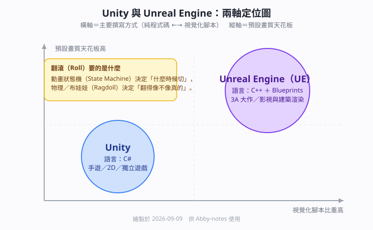

# Unity 角色翻滾插件與 Unreal Engine（UE）引擎比較

## 本篇重點 a–k，共 11 個

## 1. 先把縮寫講清楚

a. <mark style="background: #ADCCFFA6;">UE 是 Unreal Engine（虛幻引擎）的縮寫</mark>，由 Epic Games 開發，跟 Unity 並列全球兩大主流的 3D 遊戲開發引擎。這個縮寫在遊戲圈幾乎不寫全名，第一次看到很容易以為是別的東西。

b. <mark style="background: #ADCCFFA6;">Ragdoll（布娃娃系統）</mark>是一種讓角色骨架交給物理引擎接管的模擬方式。
    當角色被撞飛或失去控制時，引擎不再播放預錄動畫，而是即時用剛體與關節約束算出每一根骨頭該往哪裡倒，所以摔倒的姿勢每次都不一樣。

c. <mark style="background: #ADCCFFA6;">State Machine（動畫狀態機）</mark>是把角色的每一個動作當成一個狀態（站立、跑、翻滾、攀爬），再定義「在什麼條件下從 A 狀態切到 B 狀態」的一張圖。
    翻滾之所以需要狀態機，是因為它必須知道「玩家現在是在跑步還是在半空中」，才決定要播前滾翻還是空翻。

d. <mark style="background: #ADCCFFA6;">Parkour（跑酷）系統</mark>指的是翻牆、攀爬、蹬牆跳這一整組跟場景互動的位移動作，通常會搭配 Trigger（觸發器）偵測角色前方有沒有可攀附的邊緣。

## 2. 讓角色「翻起來」的 Unity 插件

e. <mark style="background: #FFF3A3A6;">翻滾這件事拆開來看只有兩件事</mark>：一是「什麼時候切成翻滾動作」（動畫狀態機負責），二是「翻得像不像真的」（物理模擬負責）。下面四個插件就是分別強化這兩件事。

| 插件 | 定位 | 翻轉／翻滾支援 | 適用專案 |
|---|---|---|---|
| Invector Third Person Controller | Unity 最成熟的第三人稱控制器之一 | 內建完整動作狀態機，含前翻滾 Roll、閃避空翻，可用 Trigger 綁翻牆與攀爬 | 想快速搭好移動、翻滾、戰鬥基礎的專案 |
| PuppetMaster | 基於 Ragdoll 布娃娃與物理模擬 | 適合有物理碰撞與重量感的翻滾，或被撞飛的失控翻滾 | 追求真實物理反應或搞笑摔倒效果 |
| Corgi Engine（2D）／TopDown Engine（2D 與 3D） | 橫向捲軸或俯視角的成套引擎 | 內建一鍵閃避 Dash 與 Roll、空中翻轉 | 2D 動作遊戲、類銀河惡魔城 |
| Malbers Animations（Animal Controller／Parkour System） | 針對非人角色與極限運動設計的動畫系統 | 支援動物跳躍翻滾、空中翻轉與地形適應 | 動物角色、跑酷類玩法 |

f. <mark style="background: #BBFABBA6;">選型建議</mark>：如果翻滾只是「按一下閃避」這種可預期的動作，用 Invector 這類狀態機型插件即可；如果需要「被打飛之後自然倒下」這種不可預期的姿態，才需要 PuppetMaster 這種物理型插件。兩者可以並存，多數專案是狀態機負責主動作、Ragdoll 負責受擊反應。

## 3. Unity 與 Unreal Engine 的核心差異

| 特性 | Unity | Unreal Engine（UE） |
|---|---|---|
| 主要程式語言 | C# | C++ 為主，另有 Blueprints 視覺化腳本 |
| 非程式背景友善度 | 需要寫 C# 才能做出邏輯 | Blueprints 可以完全不寫程式碼就拉出可玩的互動場景 |
| 預設畫質與光影 | 彈性高，2D、手遊到 3D 獨立遊戲都能做 | 預設畫質極高，適合 3A 大作與影視特效 |
| 學習曲線 | C# 相對好上手，生態系與教學資源豐富 | C++ 門檻較高，且 UE 的 C++ 有自己一套慣例，跟標準 C++ 寫法有落差 |
| 常見主力戰場 | 手遊與獨立遊戲市場 | 主機與 PC 的 3A 大作、建築與影視渲染 |

g. <mark style="background: #FFF3A3A6;">實務上多數 UE5 團隊是混用的</mark>：效能吃緊的系統與引擎擴充用 C++ 寫，遊戲邏輯與快速原型用 Blueprints 拉，而不是二選一。

h. <mark style="background: #D2B3FFA6;">語言差異背後其實是執行模型的差異</mark>：C++ 直接編譯成機器碼，效能天花板高但寫錯就直接崩；C# 先編譯成中介語言（IL），再由執行環境用 JIT（Just-In-Time，即時編譯）轉成機器碼，開發速度快、記憶體由 GC 管理。這跟前端筆記裡談的編譯與執行時機是同一組概念。

## 4. ⚠️ 存疑與更正

i. <mark style="background: #FF5582A6;">Gemini 說「Unity 在獨立開發者與手遊市場市佔率極高」</mark>，這句話在「手遊與獨立遊戲」這個限定範圍內成立，但如果講的是整體開發者的主要引擎選擇，2026 年的多份產業比較指出 Unreal 反而較高（約四成對三成）。<mark style="background: #FF5582A6;">看到「市佔率」三個字時要先問清楚是哪一個市場</mark>。

j. <mark style="background: #FFB8EBA6;">插件價格與維護狀態會變</mark>：上表四個插件都是 Unity Asset Store 的付費商品，是否仍在維護、是否支援你當下的 Unity 版本，要到商店頁面看最後更新日期，不能只憑本篇。

## 5. 關聯筆記與理由

k. 這篇跟 vault 內既有筆記的關聯如下，理由寫在後面而不是只丟連結：

- [[機器碼、位元組碼與機器指令是一樣的嗎]] — 因為 Unity 用 C#、UE 用 C++，兩邊差別的根源就是「原始碼要經過幾層才變成 CPU 看得懂的東西」，這篇把機器碼與位元組碼的界線講清楚了，正好補上重點 h 的底層。
- [[JIT與useMemo-CPU記憶體取捨]] — C# 靠 JIT 在執行時把 IL 轉成機器碼，這篇談的正是 JIT 用「先花時間編譯換之後跑得快」的取捨，跟遊戲引擎為什麼願意付出啟動成本是同一個道理。
- [[V8引擎完整管線-Parse到Deoptimization]] — V8 對 JavaScript 做的事（解析、位元組碼、熱點最佳化、去最佳化）跟 Unity 的 Mono／IL2CPP 對 C# 做的事結構相同，把兩邊對照著看，會發現「引擎」這個詞在瀏覽器與遊戲界指的是類似的東西。

> [!tip] LeetCode／NeetCode 對應題目
> 本篇屬於工具選型與引擎架構，<mark style="background: #D2B3FFA6;">沒有對應的 LeetCode 或 NeetCode 題目</mark>。若想練跟狀態機有關的演算法思路，可以做 [LeetCode 65. Valid Number](https://leetcode.com/problems/valid-number/)（用有限狀態機解析字串）當作 State Machine 的思考練習。

## 各對話來源

### Unity 角色翻滾插件與 UE 介紹（2026-09-09 擷取）— https://gemini.google.com/app/301752cb0703c45c

使用者：遊戲插件 讓自己翻起來 有什麼／一定要用 unity 開發／UE 是什麼？

Gemini：讓角色在遊戲中翻轉（如翻滾、翻牆、空翻等）的 Unity 插件主要分為角色動畫與操控系統以及專業 parkour／physics 工具。

1. 支援翻滾／翻轉的 Unity 軟體與插件

Invector Third Person Controller（Melee／Shooter Template）— 特點：Unity 最知名且成熟的第三人稱控制器之一。翻轉支援：內建完整動作狀態機，包含前翻滾（Roll）、閃避空翻，並可透過 Trigger 輕鬆綁定翻牆或攀爬動作。適用：想快速搭好角色基礎（移動、翻滾、戰鬥）的專案。

PuppetMaster — 特點：基於布娃娃系統（Ragdoll）與物理模擬的插件。翻轉支援：適合製作「帶有物理碰撞與重量感」的翻滾或失控翻滾（如被撞飛、失重空翻）。適用：追求真實物理反應或搞笑摔倒效果的遊戲。

Corgi Engine（2D）／TopDown Engine（2D／3D）— 特點：2D／2.5D 橫向捲軸或俯視角經典引擎。翻轉支援：內建一鍵閃避（Dash／Roll）與空中翻轉功能，免去寫 2D 物理姿態狀態機的麻煩。適用：2D 動作遊戲、類銀河惡魔城遊戲。

Malbers Animations（Animal Controller／Parkour System）— 特點：針對非人角色（動物、怪獸）或極限運動（跑酷）設計的動畫系統。翻轉支援：支援動物跳躍翻滾、空中翻轉與地形適應。

2. UE 是什麼？

UE 是 Unreal Engine（虛幻引擎）的縮寫，由 Epic Games 開發，是全球與 Unity 並列兩大最主流的 3D 遊戲開發引擎。

Unity 與 UE 的核心差異簡明對比：主要程式語言 Unity 是 C#，UE 是 C++ 及藍圖（Blueprints 視覺化腳本）；畫質與光影 Unity 彈性高，適合 2D、手機遊戲到 3D 獨立遊戲，UE 預設畫質極高，適合 3A 大作、影視特效；學習曲線 Unity 語言相對好上手、生態系豐富，UE 的 C++ 門檻較高，但藍圖對非程式員極度友善；開發社群 Unity 在獨立開發者與手遊市場市佔率極高，UE 是主機、PC 3A 大作與建築／影視渲染主力。

（Gemini 最後提供延伸選項：在 Unity 中如何用 Code 實現角色翻滾 Roll、Invector 插件的安裝與動作設定流程。）

## 資料來源（含查證時間）

| 主題 | 連結 | 版本／時間 |
|---|---|---|
| 本篇原始對話 | `https://gemini.google.com/app/301752cb0703c45c` | Gemini 對話，2026-09-09 擷取 |
| Unreal 與 Unity 技術比較（語言、學習曲線、適用情境） | `https://gamestudio.n-ix.com/unity-vs-unreal-which-to-choose/` | 2026 年版比較，查證日 2026-09-09 |
| C# 與 C++ 在 Unity／Unreal 的差異 | `https://www.circuitstream.com/en/blog/c-vs-c-complete-comparison-between-unity-and-unreal-programming-language` | 查證日 2026-09-09 |
| Blueprints 與 C++ 的分工實務 | `https://www.strayspark.studio/blog/blueprint-vs-cpp-unreal-engine-2026` | 2026 Edition，查證日 2026-09-09 |
| 引擎主要選用比例（Unreal 約 42%、Unity 約 30%） | `https://respawn.outlookindia.com/gaming/gaming-guides/unity-vs-unreal-2026-which-game-engine-should-you-learn-first` | 2026 年統計，查證日 2026-09-09 |
| 本篇圖解 | `obsidian-attachment/學習遊戲引擎_圖解_Unity與UnrealEngine的語言與定位兩軸_2026-09-09.svg` | 繪製於 2026-09-09 |

---

由 Gemini 對話自動整理 · 更新於 2026-09-09
